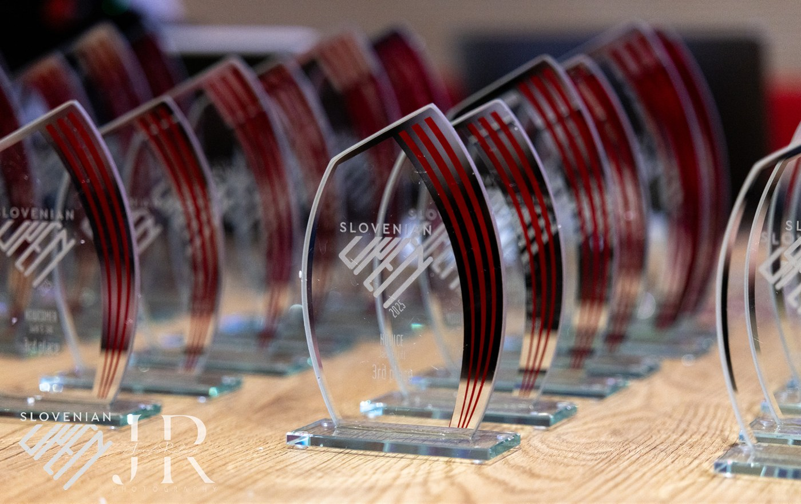

## Uvod

Hej, a tebe so tudi prepričali, da greš na tekmovanje? Nikakor ni samoumevno, da v plesu tekmujemo. Večina se nas je plesa lotila kot družabne aktivnosti, kjer si želimo predvsem druženja in užitka ob gibanju in glasbeni spremljavi. Vsak, ki je v plesu vztrajal dlje časa, je nemara ugotovil, da je plesni užitek pogosto povezan z napredovanjem. V tem kontekstu pa tekmovanja lahko najdejo svoje mesto tudi, če se nočete primerjati z drugimi.

Udeležba na tekmovanjih spremeni pogled na ples. Nabor različnih figur, po katerem vsaj moški del populacije hlepi na začetku, naenkrat naleti na še pomembnejšo kategorijo, in sicer na kakovost, ki je nujno pogojena s splošno ali specifično plesno tehniko. Kakovost si lahko v sistemu plesnega znanja predstavljamo kot vertikalo, ki jo horizontalno dopolnjuje konkretna vsebina (figure, deli figur, *footwork*, muzikaličnost ipd.) oz. plesna širina. Na plesnih tekmovanjih se primarno ocenjuje kakovost plesa, ki je predvsem v začetnih kategorijah (*newcomer* in *novice*), pa tudi v kategoriji *intermediate*, omejena na osnovne prvine plesne tehnike: *timing*, tehniko in timsko delo, v tem prioritetnem vrstnem redu.

Priročnik, ki je pred vami, je in bo verjetno še dolgo časa ostal v delu. Razvijal se bo z novo pridobljenim znanjem in tekmovalni poti skozi (upam) višje tekmovalne kategorije. Trenutna vsebina zadošča za kategoriji *newcomer* in *novice*. Največje luknje so v drugem poglavju (O ocenjevanju) od razdelka o elementih (povzetih po predavanjih Chucka Browna) dalje, kjer elementi, ki so predvsem pomembni za plesalce v višjih kategorijah, niso podrobneje opisani.

> **Jezik v priročniku:** Ko pišemo o *west coast swingu* (WCS), se ne moremo izogniti uporabi angleških izrazov, v zadregi pa smo tudi pri uporabi spola. Ker WCS nima tradicionalno zakoličenih vlog plesalca, ki vodi, in plesalke, ki sledi, v WCS dosledno uporabljamo angleška izraza *leader* (tisti, ki vodi) in *follower* (tisti, ki sledi). Vlogi nista vezani na spol in velik odstotek WCS plesalcev pleše v obeh vlogah, pri čemer ni nujno, da je primarna vloga enaka pričakovani tradicionalni glede na spol. Pri tem oba izraza v priročniku sklanjamo v moški obliki. Angleške izraze uporabljamo tudi tam, kjer prevodi niso smiselni oz. bi samo še dodatno zmedli začetnika. Tako plesne kategorije poimenujemo z izvirnimi imeni: *newcomer*, *novice*, *intermediate*, *advanced*, *all star* in *champion*. Angleške izraze povsod v priročniku pišemo *ležeče*. Tudi za določene druge izraze nismo našli boljšega prevoda, zato uporabljamo izvirnik. Takšni so npr. *timing*, *footwork* ipd.

Da bi bilo negotovosti čim manj, v naslednjem poglavju podajamo slovarček izrazov, ki prevaja iz angleščine v slovenščino.

<figure>

<figcaption>Pokali za Slovenian Open.</figcaption>
</figure>

### Namen

Plesna tekmovanja v west coast swingu so namenjena predvsem preizkusu lastnega znanja, v sistemu festivalov pa ti rezultati potem pomagajo tudi pri razvrščanju plesalcev v po znanju enakovredne skupine na delavnicah. Na različnih stopnjah delavnic in tečajev plesalci namreč osvojijo različne plesne tehnike in znanja, ki se nato preverjajo na tekmovanjih.

### Slovarček osnovnih pojmov

> V tem razdelku poskušamo uvesti osnovne pojme (vsi v izvirniku prihajajo iz angleščine), ki jih uporabljamo v celotnem priročniku.

::: glossary

#### Splošni izrazi

::: {.gloss-en}
[**EN**]{.tag-en} ▸ **WSDC**: World Swing Dance Council. An international organization that promotes and regulates competitive West Coast Swing dancing. It manages dancer points, event registration, and standardization of competition formats.
:::

::: {.gloss-sl}
[**SL**]{.tag-sl} ▸ **WSDC**: Svetovni svet za swing plese. Mednarodna organizacija, ki promovira in standardizira tekmovanja v plesu West Coast Swing. Vodi registracijo plesalcev, podeljuje točke in potrjuje dogodke.
:::

::: {.gloss-en}
[**EN**]{.tag-en} ▸ **Event**: Dance gathering where social dancing, workshops, and competitions occur over several days.
:::

::: {.gloss-sl}
[**SL**]{.tag-sl} ▸ **Festival**: Plesno srečanje z delavnicami, družabnim plesom in tekmovanji, ki običajno traja več dni.
:::

::: {.gloss-en}
[**EN**]{.tag-en} ▸ **Registry event**: An official event recognized by the WSDC where points from Jack and Jill competitions are tracked in the WSDC registry for dancer rankings.
:::

::: {.gloss-sl}
[**SL**]{.tag-sl} ▸ **Festival pod okriljem WSDC**: Dogodek, ki ga priznava WSDC in kjer se v *Jack and Jill* tekmovanjih pridobljene točke beležijo v uradni register plesalcev.
:::

::: {.gloss-en}
[**EN**]{.tag-en} ▸ **Competition**: A structured dance contest within an event, typically involving one of the WSDC recognized formats (e.g., Jack and Jill, Strictly Swing).
:::

::: {.gloss-sl}
[**SL**]{.tag-sl} ▸ **Tekmovanje**: Plesno tekmovanje v okviru festivala, običajno v eni od WSDC prepoznanih oblik (npr. *Jack and Jill*, strictly swing).
:::

#### Struktura tekmovanja

::: {.gloss-en}
[**EN**]{.tag-en} ▸ **Tier**: A classification system based on the number of competitors and point values assigned. Determines how many points are awarded for placements in competitions.
:::

::: {.gloss-sl}
[**SL**]{.tag-sl} ▸ **Rang** (tudi **Razred velikosti**): Razred tekmovanja, ki določa vrednost točk glede na število sodelujočih. Višji rang pomeni več točk za dosežena mesta.
:::

::: {.gloss-en}
[**EN**]{.tag-en} ▸ **Competition round**: Stages of elimination in a competition. **Prelims** (Preliminary Round): initial round where judges evaluate all competitors. **Quarters** (Quarterfinals): if the pool is large enough, an additional filtering round. **Semis** (Semifinals): fewer competitors, typically 30–50% of the field. **Finals**: top dancers compete for placement and points.
:::

::: {.gloss-sl}
[**SL**]{.tag-sl} ▸ **Krog tekmovanja**: Faze izločanja v tekmovanju. **Predtekmovanje** (Prelims): začetni krog, kjer sodniki ocenijo vse pare. **Četrtfinale** (Quarters): vmesni krog, če je prijavljenih zelo veliko plesalcev. **Polfinale** (Semis): nadaljnja selekcija najboljših. **Finale** (Finals): najboljši pari se pomerijo za mesta in točke.
:::

::: {.gloss-en}
[**EN**]{.tag-en} ▸ **Division**: A competition level based on either skill level: Newcomer, Novice, Intermediate, Advanced, All-Star, Champions; or age: Juniors, Sophisticated, Masters.
:::

::: {.gloss-sl}
[**SL**]{.tag-sl} ▸ **Divizija** (pog. tudi **Kategorija**): Raven tekmovanja glede na plesalčevo znanje: Novinec (Newcomer), Začetnik (Novice), Srednji (Intermediate), Napredni (Advanced), All-Star, Šampioni (Champions); ali starost: mladinci (Juniors), mlajši veterani (Sophisticated), veterani (Masters).
:::

::: {.gloss-en}
[**EN**]{.tag-en} ▸ **Heat**: A subset of competitors dancing at the same time on the floor during a round, especially when the field is large.
:::

::: {.gloss-sl}
[**SL**]{.tag-sl} ▸ **Skupina**: Skupina plesalcev, ki pleše naenkrat med posameznim krogom, ko je tekmovalcev preveč za istočasno ocenjevanje.
:::

#### Sojenje in ocenjevanje

::: {.gloss-en}
[**EN**]{.tag-en} ▸ **Scoring**: The process by which judges rate or rank competitors. The final score is usually based on multiple criteria like timing, technique, teamwork, musicality, and presentation.
:::

::: {.gloss-sl}
[**SL**]{.tag-sl} ▸ **Točkovanje**: Postopek ocenjevanja tekmovalcev s strani sodnikov. Skupno končno oceno sodnik določi s pomočjo različnih kriterijev, kot so npr. ritem, tehnika, sodelovanje v paru, muzikalnost in predstavitev.
:::

::: {.gloss-en}
[**EN**]{.tag-en} ▸ **Callback system**: A method for selecting which competitors move on to the next round.
:::

::: {.gloss-sl}
[**SL**]{.tag-sl} ▸ **Callback sistem**: Način izbire, kdo napreduje v naslednji krog.
:::

#### Osebje in organizacija

::: {.gloss-en}
[**EN**]{.tag-en} ▸ **Marshalling**: The coordination of competitors before they enter the dance floor. Ensures competitors are in the right place at the right time.
:::

::: {.gloss-sl}
[**SL**]{.tag-sl} ▸ **Preverjanje prisotnosti**: Organizacija plesalcev pred vstopom na plesišče. Zagotavlja, da so na pravem mestu ob pravem času.
:::

::: {.gloss-en}
[**EN**]{.tag-en} ▸ **Marshall**: A staff member who organizes and lines up dancers for each heat and round.
:::

::: {.gloss-sl}
[**SL**]{.tag-sl} ▸ **Kontrolor za preverjanje prisotnosti**: Oseba, ki usmerja in razporeja plesalce za posamezne skupine in kroge.
:::

::: {.gloss-en}
[**EN**]{.tag-en} ▸ **Floor mom**: A staff member who takes the dancers onto the floor.
:::

::: {.gloss-sl}
[**SL**]{.tag-sl} ▸ **Skrbnica plesišča**: Član/ica osebja, ki skupino plesalcev vodi na plesišče.
:::

::: {.gloss-en}
[**EN**]{.tag-en} ▸ **Judge**: An official who evaluates dancers and contributes to scoring and advancement decisions.
:::

::: {.gloss-sl}
[**SL**]{.tag-sl} ▸ **Sodnik**: Oseba, ki ocenjuje plesalce in sodeluje pri odločanju o napredovanju.
:::

::: {.gloss-en}
[**EN**]{.tag-en} ▸ **Chief judge**: The head judge responsible for overseeing the judging panel, ensuring consistency in scoring, managing disputes, and coordinating with tabulation and event directors.
:::

::: {.gloss-sl}
[**SL**]{.tag-sl} ▸ **Glavni sodnik**: Vodja sodnikov, odgovoren za usklajevanje ocenjevanja, reševanje nesoglasij in sodelovanje z organizatorji.
:::

#### Tekmovalne vloge

::: {.gloss-en}
[**EN**]{.tag-en} ▸ **Role**: The dancer's position in the partnership. **Leader**: initiates the movement. **Follower**: responds to the lead.
:::

::: {.gloss-sl}
[**SL**]{.tag-sl} ▸ **Vloga**: Vloga plesalca v paru. **Vodja**: vodi gibanje. **Sledilec**: odziva se na vodstvo.
:::

::: {.gloss-en}
[**EN**]{.tag-en} ▸ **Primary role**: The main role a dancer competes in (Leader or Follower). It is used for points tracking and division placement.
:::

::: {.gloss-sl}
[**SL**]{.tag-sl} ▸ **Primarna vloga**: Glavna vloga, v kateri plesalec tekmuje (vodja ali sledilec). Na podlagi nje se vodi zbiranje točk in določanje divizije.
:::

::: {.gloss-en}
[**EN**]{.tag-en} ▸ **Secondary role**: A dancer's additional role (opposite to their primary) they may compete in but is tracked separately.
:::

::: {.gloss-sl}
[**SL**]{.tag-sl} ▸ **Sekundarna vloga**: Dodatna vloga (nasprotna primarni), v kateri lahko plesalec prav tako tekmuje. Točke se zbirajo ločeno.
:::

:::
