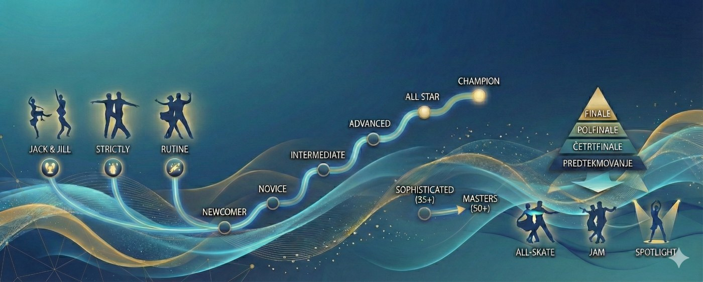

<figure class="page-break">

<figcaption>Shematski pregled tekmovalnega sistema west coast swinga: vrste tekmovanj, kategorije in formati izvedbe.</figcaption>
</figure>

## Tekmovalni sistem

> Kot vsak tekmovalni šport, ima tudi west coast swing definiran tekmovalni sistem, ki vključuje vse od definicij vrst tekmovanj do opisa sistema točkovanj.

### Vrste tekmovanj

Glavni tip tekmovanj, na katerega se osredotoča tudi tale priročnik, je ***Jack and Jill*** **(tudi *J’n’J*)**. V naši okolici so razširjena še t. i. **strictly** tekmovanja. Sicer pa poznamo še **rutine** (v divizijah *classic*, *showcase* in *rising star*) in razna zabavna tekmovanja (npr. Sepp & Heidi na Bavarian Open). Posebno dimenzijo predstavlja še divizija ProAm (ki se lahko pojavi v tekmovanjih *Jack and Jill*, *strictly* ali v Evropi predvsem pri rutinah).

Tekmovanje ***Jack and Jill*** pomeni, da se na tekmovanje prijaviš posamezno. Partner ti bo dodeljen na licu mesta naključno in z njim boš plesal na naključno skladbo. Med vsakim plesom v izbirnih krogih tekmovanja se boste zamenjali, v finalu pa boste dobili naključnega partnerja, s katerim boste plesali skupaj do konca.

Tekmovanje ***strictly*** je po vseh karakteristikah enako tekmovanju *Jack and Jill*, le da se na tekmovanje prijaviš v paru in kot par plešeta od začetka do konca. Še vedno pa velja, da plešeta na naključno izbrano glasbo.

V **rutinah** plešeš z izbranim partnerjem na izbrano glasbo.

### Izbira kategorije

Prvi stik s tekmovanji v west coast swingu naj bi predstavljal sproščeno izkušnjo, zabavo in spoznavanje s postopki. Zaradi tega tako organizatorji kot učitelji priporočajo, da si prvič izbereš kategorijo *newcomer*. Dosežene točke v tej kategoriji ne vplivajo na nič, zato je tudi pritisk na samega tekmovalca pred/med/po tekmovanju manjši, izkušnja pa je zato prijetna in motivirajoča.

Če si plesni učitelj ali pa bivši plesni tekmovalec, potem se spodobi (ni pa to pravilo), da kategorijo *newcomer* preskočiš in poskusiš neposredno v kategoriji *novice*, kjer pa ima točkovanje že vpliv na tvojo bodočo pot v west coast swingu. Osvojena točka ti namreč običajno omogoči udeležbo na naprednejših delavnicah na festivalih in nemara še kakšne druge ugodnosti.

Kot nov obiskovalec tekmovanj imaš namreč na začetku možnost, da nastopiš v kategoriji *newcomer* ali *novice*. Udeležba v višjih kategorijah je pogojena z minimalnim številom osvojenih točk v nižjih kategorijah, hkrati pa je tudi omejena s številom osvojenih točk v tej kategoriji.

V kategoriji *newcomer* lahko nastopaš samo tako dolgo, dokler ne osvojiš prve točke. Potem moraš nujno v kategorijo *novice*. V *intermediate* smeš šele, ko osvojiš vsaj 16 novice točk. V kategoriji *novice* pa ne smeš več nastopati, če osvojiš 30 ali več *novice* točk. Podobno velja za ostale kategorije, kar lepo prikazuje spodnja slika (WSDC, 2025).

<table>
<caption>Prehod med kategorijami v tekmovalnem sistemu WSDC (WSDC, 2025)</caption>
<thead>
<tr><th scope="col">Kategorija</th><th scope="col">Opredelitev</th><th scope="col">Lahko napreduje</th><th scope="col">Mora napredovati</th></tr>
</thead>
<tbody>
<tr><th scope="row">Champion</th><td>tekmovalci najvišjege divizije</td><td>1 Champion točka</td><td>10 Champion točk</td></tr>
<tr><th scope="row">All Star</th><td>ekstremno tekmovalni</td><td>150 All Star točk</td><td>225 All Star točk</td></tr>
<tr><th scope="row">Advanced</th><td>zelo tekmovalni</td><td>60 Advanced točk</td><td>90 Advanced točk ali 1+ All Star točka</td></tr>
<tr><th scope="row">Intermediate</th><td>izpopolnjujejo tekmovalne plesne veščine</td><td>30+ Intermediate točk</td><td>45+ Intermediate točk ali 1+ Advanced točka</td></tr>
<tr><th scope="row">Novice</th><td>prikažejo osnovne plesne veščine</td><td>16+ Novice točk</td><td>30+ Novice točk ali 1+ Intermediate točka</td></tr>
<tr><th scope="row">Newcomer</th><td>novinci na tekmovanjih v določeni vlogi</td><td>po lastni presoji tekmovalca</td><td>1+ Newcomer točka ali 1+ Novice točka (glede na vlogo)</td></tr>
</tbody>
</table>

Ko enkrat v svoji primarni plesni vlogi že tekmuješ v eni od višjih kategorij (*novice*\+), potem lahko na istem tekmovanju v nižji kategoriji tekmuješ tudi v svoji sekundarni plesni vlogi. Npr. če tekmuješ kot leader v *novice* in še nimaš osvojenih točk v vlogi *follower* v *newcomer* kategoriji, lahko v tej nastopiš še kot *follower*. Ponavadi v sekundarni vlogi tekmuješ eno kategorijo niže, WSDC pa po 1\. 1\. 2025 omogoča, da brez prošnje (*petition*), ki je bila predhodno potrebna, *advanced* in *all star* tekmovalci tekmujejo celo dve kategoriji niže.

Poleg teh kategorij obstajajo tudi starostne kategorije. Pri nas najbolje poznamo kategorijo *sophisticated* (odprta kategorija za vse plesalce stare 35 let in več oz. mlajše veterane) in kategorijo *masters* (odprta kategorija za vse plesalce stare 50 let in več oz. veterane). Obstaja tudi mladinska kategorija \- *junior*, v kateri pa se v Evropi skoraj nikjer ne tekmuje (izjema je zaenkrat Francija).

### Točkovanje

Na tekmovanjih pod okriljem WSDC določeno število najbolje uvrščenih tekmovalcev (od katerih vsi nastopijo v finalu) osvoji WSDC točke. Število točk je odvisno od števila tekmovalcev, ki so v določeni vlogi nastopili v določeni kategoriji, in od osvojenega mesta. Vsi podatki so prikazani v spodnji tabeli.

<table>
<caption>Vrednotenje kategorij na WSDC tekmovanjih (Vir: WSDC, 2025)</caption>
<thead>
<tr><th scope="col">Razred (tier)</th><th scope="col">Št. tekmovalcev (na vlogo)</th><th scope="col">1\. mesto</th><th scope="col">2\. mesto</th><th scope="col">3\. mesto</th><th scope="col">4\. mesto</th><th scope="col">5\. mesto</th><th scope="col">Dodatna mesta v finalu</th></tr>
</thead>
<tbody>
<tr><th scope="row">1</th><td>5-10</td><td>3</td><td>2</td><td>1</td><td>0</td><td>0</td><td>0</td></tr>
<tr><th scope="row">2</th><td>11-19</td><td>6</td><td>4</td><td>3</td><td>2</td><td>1</td><td>0</td></tr>
<tr><th scope="row">3</th><td>20-39</td><td>10</td><td>8</td><td>6</td><td>4</td><td>2</td><td>1 (do 10. mesta)</td></tr>
<tr><th scope="row">4</th><td>40-79</td><td>15</td><td>12</td><td>10</td><td>8</td><td>6</td><td>1 (do 12. mesta)</td></tr>
<tr><th scope="row">5</th><td>80-129</td><td>20</td><td>16</td><td>14</td><td>12</td><td>10</td><td>2 (do 15. mesta)</td></tr>
<tr><th scope="row">6</th><td>130+</td><td>25</td><td>22</td><td>18</td><td>15</td><td>12</td><td>2 (do 15. mesta)</td></tr>
</tbody>
</table>

Na Slovenian Open 2025 je denimo v kategoriji *newcomer* nastopilo 44 *followerjev* in 38 *leaderjev*. *Followerji* so tako imeli tekmovanje 4\. razreda velikosti (ang. *tier*; več informacij v naslednjem poglavju), leaderji pa 3\. razreda velikosti. Zmagovalka tekmovanja med *followerji* je tako dobila 15 WSDC točk, zmagovalec pa le 10, kar izhaja iz zgornje tabele. V finalu je nastopilo 12 parov, kar odgovarja številu tistih, ki osvojijo točke na tekmovanju 4\. razreda velikosti. To pomeni, da so vsi *followerji* od 6\. do 12\. mesta osvojili po 1 točko, medtem kot *leaderja* na 11\. in 12\. mestu nista osvojila nobene točke.

Poseben status imajo glede na točkovanje mesta od 1 do 5\. Imenujemo jih tudi *placement*. Na daljši rok je odstotek teh mest (kot tudi odstotek zmag) pokazatelj kvalitete določenega tekmovalca pri plesu v finalu (v paru).

Po 1\. 1\. 2025 je WSDC za kategorije 4\. razreda velikosti zmanjšal število tekmovalcev, ki osvajajo točke, kar še posebej prizadene večino tekmovanj v naši bližini. Pred letom 2025 je točke osvajalo prvih 15 tekmovalcev, po novem pa samo še prvih 12\.

### Potek tekmovanja

Cilj posameznega tekmovanja je izbrati najboljše tekmovalce. Ker je prijavljenih tekmovalcev ponavadi veliko, je nemogoče, da bi sodniki lahko izbrali dokončni vrstni red v samo enem tekmovalnem krogu (ang. *round*). 

Glede na **razred velikosti ali rang (ang. *tier*)** posamezne kategorije, tekmovanja za to kategorijo sestojijo iz več krogov. Če je na tekmovanju npr. 60 *followerjev*, tekmovanje spada v razred velikosti 4, kar narekuje, da je potrebno organizirati predtekmovanje, polfinale in finale. Če na tem tekmovanju nastopi 39 *leaderjev*, bodo le-ti prav tako nastopili v 3 tekmovalnih krogih. Sistem se ravna po največjem številu tekmovalcev v posamezni vlogi v kategoriji. Celotna tabela je prikazana spodaj.

<table>
<caption>Organizacija WSDC tekmovanj glede na število prijavljenih tekmovalcev (WSDC, 2025)</caption>
<thead>
<tr><th scope="col">Razred (tier)</th><th scope="col">Št. tekmovalcev</th><th scope="col">Št. krogov</th><th scope="col">Predtekmovanje</th><th scope="col">Četrtfinale</th><th scope="col">Polfinale</th><th scope="col">Finale</th></tr>
</thead>
<tbody>
<tr><th scope="row">1</th><td>5-10</td><td>1</td><td><strong>opcijsko</strong></td><td><strong>ne</strong></td><td><strong>ne</strong></td><td><strong>da</strong> (vsaj 5 v finalu)</td></tr>
<tr><th scope="row">2</th><td>11-19</td><td>1-2</td><td><strong>opcijsko</strong></td><td><strong>ne</strong></td><td><strong>ne</strong></td><td><strong>da</strong></td></tr>
<tr><th scope="row">3</th><td>20-39</td><td>2</td><td><strong>da</strong></td><td><strong>ne</strong></td><td><strong>ne</strong></td><td><strong>da</strong></td></tr>
<tr><th scope="row">4</th><td>40-79</td><td>3</td><td><strong>da</strong></td><td><strong>ne</strong></td><td><strong>da</strong></td><td><strong>da</strong></td></tr>
<tr><th scope="row">5</th><td>80-129</td><td>3-4</td><td><strong>da</strong></td><td><strong>opcijsko</strong></td><td><strong>da</strong></td><td><strong>da</strong></td></tr>
<tr><th scope="row">6</th><td>130+</td><td>3-4</td><td><strong>da</strong></td><td><strong>opcijsko</strong></td><td><strong>da</strong></td><td><strong>da</strong></td></tr>
</tbody>
</table>

V primeru, da je v določeni vlogi pri 4\. razredu velikosti manj kot 10% več tekmovalcev, kot jih narekuje zgornja tabela, lahko organizator izpusti organizacijo polfinala, kar skrajša potek tekmovanja (in prinese precej slabe volje tekmovalcem).

#### Tekmovalni krogi

Tekmovanje običajno sestoji iz izbirnih krogov (predtekmovanje, četrtfinale in polfinale) ter finala. V izbirnih krogih tekmovalec tekmuje posamično. Ocenjen je neodvisno od plesnega partnerja. Vsako skladbo odpleše z drugim partnerjem. V finalu tekmovalec dobi enega partnerja, ocenjen je v paru.

V vsakem tekmovalnem krogu tekmovalec običajno odpleše 3 skladbe. To so ponavadi: počasna (*slow*), blues in hitra (*fast*). Običajno ena skladba traja od 90 do 120 sekund, odvisno od velikosti skupine in uspešnosti dela sodnikov. Vrstni red in tip skladb, ki se uporabljajo, ni predpisan in je odvisen od DJ-ja na tekmovanju.

#### Formati izvedbe tekmovalnega kroga

V kategorijah *novice* in *newcomer* je ponavadi format izvedbe **skupinski (*all-skate*)**. To pomeni, da so vsi pari naenkrat prisotni na plesišču. Največkrat so razporejeni v krogu (sodniki so običajno na sredini) z definirano plesno smerjo (*slot*). Včasih se zgodi, da je finale izvedeno tudi v t. i. razpršeni postavitvi, kjer vsi pari gledajo proti publiki/sodnikom in so enakomerno razpršeni po plesišču. Slednji format je sicer običajnejši za višje kategorije, kjer je dejansko že pomembno, da ima plesni par odnos s publiko/sodniki in je za določene figure pomembno, da jih zna izvesti tako, da nagovarja publiko. Pri skupinskem formatu se običajno odpleše 3 pesmi.

Poznamo še dva formata izvedbe. Tekmovalci se po skupinskem ponavadi najprej srečajo z ***push-out***\-om, ki pa mu pogovorno vsi plesalci pravimo ***jam***. *Jam* se običajno uporablja za izvedbo finala v *intermediate* kategoriji (zadnje čase pa nas pogosto preseneti tudi v kategoriji *novice*), kjer sta/so hkrati na plesišču 2 do 3 pari. Običajno odplešejo eno pesem, včasih dve. Jam se pogosto začne in/ali zaključi z vsaj eno skladbo v skupinskem formatu.

Zadnji format nosi ime ***spotlight***. V tem formatu je na plesišču en sam par, ki odpleše 1 do 2 skladbi. Obrnjen je proti sodnikom/občinstvu. Običajno se ta format uporablja za *advanced+* kategorije, včasih pa nanj naletimo tudi pri kategoriji *intermediate* ali celo *novice* (kot je bil primer na Detonation Dance 2025). Podobno kot pri *jamu*, se tudi ta format običajno dopolnjuje s skupinskim formatom za zadnjo skladbo.

Format izvedbe ni predpisan in je pogosto stvar dogovora med organizatorjem in glavnim sodnikom.

<figure>

<figcaption>Vstop na svoje prvo tekmovanje.</figcaption>
</figure>
