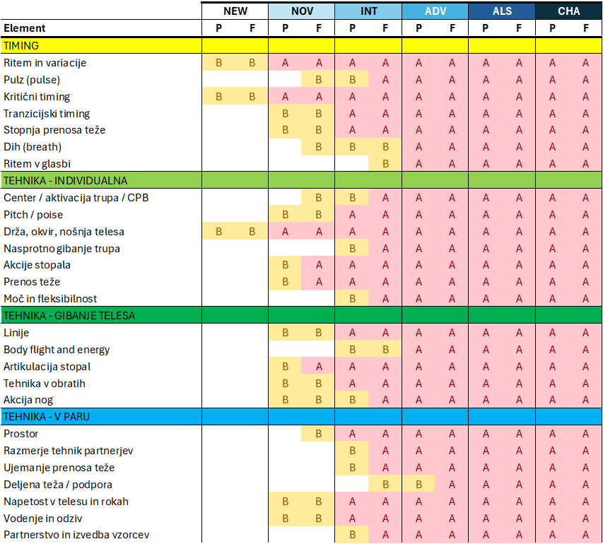
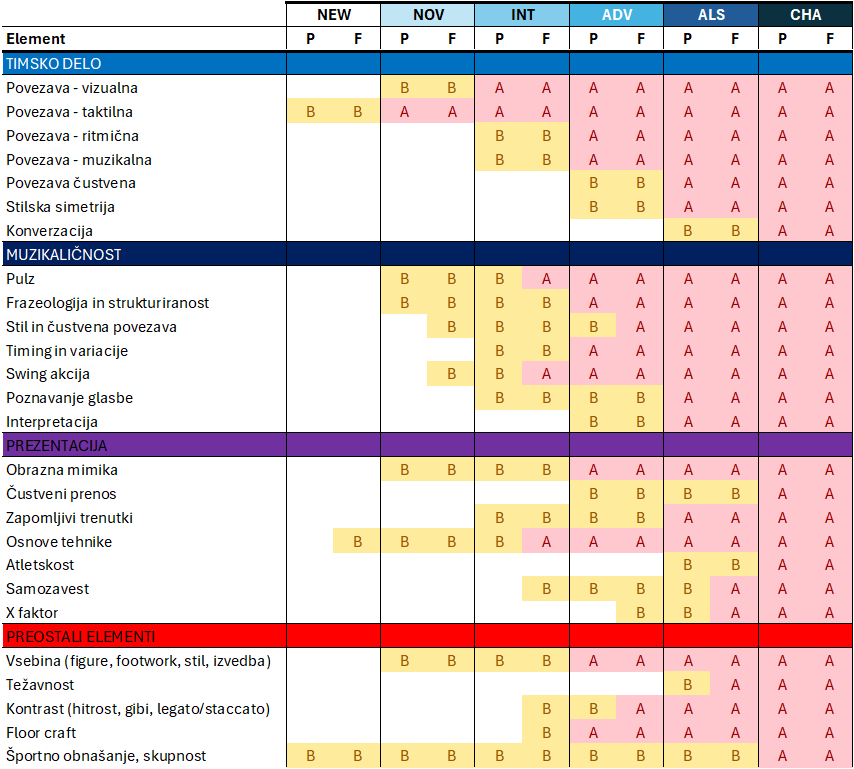

## Kriteriji

### Splošno

WCS je tehnično izjemno zahteven ples. Sistem tekmovanj, sploh v Evropi, že od začetnika zahteva ogromno znanja in veščin. Horizontalne vsebine WCS, ki vsebujejo različne figure, *footworke* ipd. so pri tekmovanjih drugotnega pomena. Važna je predvsem plesna tehnika, ki jo najlažje pokažemo v osnovnih figurah. Poleg tega je ocenjevanje vizualno. Važno je, kako je ples videti, ne kako se čuti. Vsi družabni plesalci pa zelo dobro vemo, da je precej bolj važno obratno, in sicer kako se ples čuti. Tega ne pozabi nikoli\!

> **Opozorilo:** West coast swing nima popolnoma eksplicitno postavljenih kriterijev ocenjevanja za posamezne tekmovalne kategorije. Kriteriji so okvirni in so našteti v nadaljevanju, njihovo upoštevanje in poudarki pa so odvisni od posameznega sodnika. Nekateri sodniki v *novice* kategoriji, sploh v nemško govorečem okolju, se posvečajo največ delu nog, drugi spet gledajo plesno držo, tretjim je pomembno, da se zabavate … Krmarjenje v takšnem okolju je za tekmovalca, ki je nekje na meji uvrstitve v višji krog, lahko zelo težavno, celo frustrirajoče, saj so njegovi rezultati obremenjeni z ogromno šuma (naključij) in včasih ni očitno, da so rezultati res korelirani s plesnim znanjem.

##### VRSTE ŠUMA (NAKLJUČIJ) IN PRISTRANSKOSTI

::: box
**Sodniški (sistemski) šum/pristranskost:** Vsak sodnik ima svoje kriterije. Npr. pri bluesu je nekomu pomembno, da pokažeš, da obvladaš *swung* (tudi *syncopated* ali *shuffle*) ritem, pa čeprav vam je DJ namenil *straight count* pesem. Nekateri sodniki vas bodo sodili po *timingu*, drugi po drži, tretji po komunikaciji s partnerjem ipd. Ker so trenutno v Evropi vse začetne kategorije izjemno zasičene, morajo za odločitev sodniki pogosto poseči tudi po kriterijih za višje kategorije, kjer ni čisto jasno, kateri imajo višjo prioriteto. Včasih se zgodi tudi, da se na sodniškem mestu pojavijo manj izkušeni sodniki, ki še nimajo izdelanih kriterijev.
:::

Sodniški šum naslavlja tudi trening za sodnike (Brown, 2023), v katerem se (bodoči) sodniki seznanijo s potencialnimi možnimi dejavniki, ki lahko vplivajo na njihovo pristranskost. Nekateri od teh dejavnikov se upoštevajo že pri izločitvi sodnikov, druge mora sodnik upoštevati pri svojem delu. Oseba se kot sodnik iz posamezne kategorije lahko izloči na podlagi odnosa do enega ali več tekmovalcev, npr. če gre za družinskega člana, partnerja ali kakršenkoli podoben odnos. Sodniki imajo možnost tudi, da določene kategorije ne sodijo zaradi drugih osebnih razlogov ali morebitnih drugih vplivov na njihovo neodvisnost.

Dejavniki, ki pa vedno ostajajo in naj bi se jim sodniki izognili, so: čustvene, intimne, prijateljske ali poslovne vezi s tekmovalci, javne interakcije (npr. komentarji na družbenih omrežjih), preference glede stila plesanja in tehnike, preference glede plesnih vlog (npr. ocenjevanje nasprotnega spola), zgodovina plesalca, njegova pričakovanja ali socialni status, fizični izgled ter odnos učitelja in učenca.

::: box
**Časovni šum:** Sodnik mora v minuti in pol oceniti 15 tekmovalcev (parov), včasih celo več. Namenil vam bo nekje med 5 in 10 sekundami časa v posamezni skladbi. Mogoče ravno takrat, ko se vam bo primerila napaka.
:::

::: box
**Naravni šum:** Narava *Jack and Jill* tekmovanj je, da ne poznate partnerja in ne pesmi, na katere boste plesali. Predvsem *follower* je močno odvisen od partnerja (timing, način vodenja ipd.), včasih se na *followerja* zanaša tudi *leader*, ki želi npr. ustrezen *counter balance*, računa, da bo *follower* odsledil določene figure ipd. Prav tako nam določena glasba ustreza, določena ne.
:::

Športni psihologi, ki se ukvarjajo z WCS, ves ta šum spravijo v ovir naključij. Ta naključja so vezana na plesnega partnerja, glasbo, sodnike in na tekmovalno polje oz. konkurenco (Karvinen, 2025). Samo poimenovanje (“naključje”) ima velik vpliv na razumevanje lastnih ocen, kar si bomo pogledali v nadaljevanju. **Na naključja namreč po definiciji nimamo nobenega vpliva\!**

### Elementi

> V grobem se v začetnih kategorijah ukvarjamo s tremi osnovnimi kategorijami elementov plesa, ki so znani kot “3T”: timing, timsko delo (team work) in tehnika (technique).

Kategorij elementov je sicer več in njihova sistematizacija je odvisna od avtorja. Chuck Brown jih v svojem izobraževanju za sodnike, ki ga povzemamo v tem poglavju, našteje 9 (Brown, 2023). To so:

* [**Timing**]{.crit-timing} (timing)
* [**Timsko delo**]{.crit-timsko-delo} (teamwork)
* [**Tehnika**]{.crit-tehnika} (technique)
* [**Vsebina**]{.crit-preostali} (content)
* [**Težavnost**]{.crit-preostali} (difficulty)
* [**Kontast**]{.crit-preostali} (contrast)
* [**Športno obnašanje**]{.crit-preostali} (sportmanship)
* [**Muzikaličnost**]{.crit-muzikalicnost} (musicality)
* [**Prezentacija**]{.crit-prezentacija} (presentation)

V svoji prezentaciji Chuck Brown govori tudi o eksplicitnem ocenjevanju naslednjih elementov, ki se tako ali drugače navezujejo na zgornje kategorije (večinoma pa veljajo za višje kategorije):

* [**Kemija**]{.crit-timsko-delo} (chemistry)
* [**Dihanje**]{.crit-timing} (breath)
* [**Prenos teže**]{.crit-tehnika} (weight transfer)
* [**Izvedba**]{.crit-preostali} (execution)
* [**Čustvena povezava**]{.crit-timsko-delo} (emotional connection)
* [**Simetrija**]{.crit-timsko-delo} (symmetry \- partnership)

Tematika, ki pogosto ostane skrita v debatah o ocenjevanju, pa je kvaliteta gibanja (quality of movement), ki je glede na vizualno naravo ocenjevanja verjetno ena najbolj bistvenih prvin, ki te bodo vodile do tekmovalnih uspehov. Kvaliteta gibanja je razpršena med prvine kot so: tehnika, muzikaličnost, kontrast in prezentacija.

V naslednjih podpoglavjih sledi splošen opis posameznih elementov, podrobnejši opis zahtevanih elementov in njihova izvedba pa je ob ustrezni tekmovalni kategoriji podana v naslednjem poglavju.

**Pomembno: Vsaka naslednja tekmovalna kategorija zajema celotno bazično znanje predhodnih kategorij. Če več tekmovalcev v posamezni skupini zadovoljivo izpolnjuje osnovne kriterije za to kategorijo, bo sodnik za razvrstitev uporabil kriterije, ki veljajo za višjo kategorijo.**

#### Timing {.crit-timing}

::: box
**Ritem in variacije:** obvladovanje osnovnega WCS ritma (koraki, trokoraki) in variacij ritma, npr. sinkopirane variacije za določene blues skladbe.

**Ritem v glasbi:** glasba, na katero plešemo WCS, pozna močne ali nizke udarce (downbeat), ki jih imamo na liho dobo v taktu (1, 3, 5, 7) in visoke ali šibke udarce (upbeat), ki jih imamo na sodo dobo v taktu (2, 4, 6, 8). WCS glasba ima visoke udarce pogosto bolj poudarjene.

**Pulz (*pulse*):** večina WCS glasbe ima poudarke na t. i. šibki udarec (upbeat). S plesom želimo ta poudarek pokazati, npr. z iztegom noge, sunkom prsnega koša ipd.

**Kritični timing (*critical timing*):** pomaga graditi občutek, da plešemo sinhronizirano z glasbo, v WCS to običajno pomeni natančno sinhronizacijo prvega dela koraka oz. iztega noge (*strike*) z udarcem.

**Tranzicijski timing (*transitional timing*):** prenos teže se v WCS dogaja večinoma med udarcema, s tem elementom prikažemo zakasnitev (*delay*) pri prenosu teže v korakih na celo dobo.

**Glasbeni (ritmični) timing (*musical timing*):** Glasba, primerna za WCS, je sestavljena iz številnih plasti: melodije, spremljave, ritma, dopolnjujočih inštrumentov. Kritični in tranzicijski timing lahko tako podredimo ponazoritvi ene od teh plasti, namesto, da sledimo strogemu ritmu (povzeto po Hamm, 2025).

**Stopnja prenosa teže (partial, full, delay) v trokoraku:** Trokorak zajema tri ločene korake. Če jih izvedemo s polnim prenosom teže, WCS hitro izgleda kot salsa. Zato pazimo, da na prvem koraku težo prenesemo le toliko, da naš bok še vedno ostane na isti strani. Takšno gibanje rezultira v t.i. *swing movement*-u, kjer se boki zibljejo na dobe 1, 2, 4 in 6 v osnovnih figurah (na vsak *delayed* korak).

**Dih (breath):** Dih običajno vpliva na spreminjanje razdalje med plesalcema oz. dinamiko spreminjanja te razdalje. Tipično o dihu razmišljamo na 6-in oz. na 1, ko pred prenosom teže, zadržimo dih in ustvarimo občutek zakasnjenega gibanja. Podobno lahko razmišljamo tudi o razdalji znotraj *anchor stepa*, najbolj enostavno pri ustvarjanju *stretcha*.
:::

**Vpogled v zakulisje:** Karin Kakun pravi, da do nivoja advanced ne ocenjuje in ne bi želela, da sodniki ocenjujejo sinkopiran (swung) ritem.

#### Tehnika {.crit-tehnika}

Pogosto je tehnika definirana kot “kako dobro počneš to, kar počneš” (Brown, 2023). Tehniko sicer razdelimo na dva dela, na indvidualno tehniko in tehniko v paru (*partnership*). Tehnika je zelo široka in razvejana kategorija, obstajajo pa elementi, ki so pomembnejši od ostalih. Po Brownu so to: *centering*, ravnotežje (balance), kvaliteta gibanja (*quality of movement*) in prezentacija (*presentation*).

> Celoten razdelek je povzet po gradivu za sodnike (Brown, 2023\) in marsikje presega avtorjevo znanje, zato so pripadajoče razlage lahko omejene ali celo napačne.

##### INDIVIDUALNA TEHNIKA

Skupina tehnik, ki se nanaša na delo s telesom – ravnotežje, mišični nadzor, gibanje iz centra in natančna uporaba telesnih segmentov. Te tehnike so temeljne za stabilnost, natančnost in lepoto gibanja v plesu.

::: box
**Telesne tehnike**

**Center / aktivacija trupa / centralna točka ravnotežja (CPB)**

**Ravnotežje (*pitch* *and poise*):** V WCS je poise definiran kot kot med stopali in težiščem ter služi kot orodje za nadzor gibanja v paru. Npr. *compression* na 2-4 v *sugar pushu* lahko nadziramo tako, da imamo *poise* naprej. Do neke mere to velja tudi za stretch. *Pitch* telesa je definiran s kotom med boki in ramenskim obročem ali celo glavo. Ta je običajno vedno naprej in nam pomaga pri večji stabilnosti in kontroli telesa. Običajno nam tudi omogoči, da imamo težišče na sprednjem delu stopala (*ball of the foot*). Začetniški ples pogosto izgleda nedinamičen prav zaradi neuporabe teh dveh elementov, da se z njima ponazorita *stretch* ali *compression*.

**Drža, nošnja telesa in okvir:** Drža telesa pri plesu naj bo vzravnana. Pri tem ustvarjene sile tako dodatno ne obremenjujejo sklepov in hrbtenice. Glava naj bo pokonci, hrbet naj ne bo sključen. S plesnim okvirjem mislimo predvsem na ramenski obroč, roke in na povezavo s telesom. Večino sile naj ustvarjajo hrbtne mišice (mišice, ki se aktivirajo npr. ko dvigujemo škaf perila in vlečejo lopatice skupaj), roke imajo sicer tonus, vendar z npr. bicepsi skoraj ne ustvarjamo dodatne sile. Tudi vodenje večinoma ne prihaja iz rok, pač pa iz povezave s telesom, gibanjem trupa.

**Nasprotno gibanje trupa (*contra body movement*):** Pri hoji nazaj v WCS uporabljamo t. i. *contra body movement*, kjer takrat, ko gre leva noga nazaj, gre leva rama naprej. Pri hoji naprej, je ponavadi ravno obratno.

**Prenos teže in stopnja prenosa teže (partial, full, delay) ter swing gibanje (*swing movement*):** Večinoma se prenosi teže v WCS dogajajo med udarcema. Najprej sledi korak (*strike*), nato šele prenos. Trokorak ima na začetku samo delni prenos teže (teža ostane na prejšnji nogi), nato polni prenos na že obremenjeno nogo, sledi pa običajen *delayed* korak. Pri swing gibanju govorimo o nihanju telesa po prenosu teže. Pri polnih korakih (polni prenos), se prenese tudi težišče in vizualno boki gredo nad nogo, ki nosi težo. Pri trokorakih (*partial-full-delayed*), se prenos teže na drugo nogo naredi šele na *delayed* korak in takrat se tudi prenese teža. Naravno, ko je teža prenešena nad eno nogo, se zgodi tudi rotacija telesa navzven.

**Akcije stopala (peta ali prsti naprej, sprostitev prstov):** Prenost teže se zgodi bodisi na prste (več kontrole), bodisi na peto sprejemajoče noge. V evropskem prostoru in nasploh v zadnjem času sta obe tehniki sprejemljivi. Predvsem pri hoji naprej se večkrat poslužujemo stopanja na peto. Akcija stopala je predvsem indikator prenosa teže. Počasen prenos (prsti-peta) kaže kontroliran gib in postopno izvedbo prenosa (*transitional timing*). Akcija stopala izhaja iz akcije kolen, kjer koleno npr. ob sprostitvi stopala gre naprej (peta se dvigne).

**Moč in fleksibilnost**
:::

::: box
**Gibanje telesa** (tehnike, ki oblikujejo individualnen plesni slog), segmentirano gibanje.

**Linije:** pozicije stopal in *turnout* (stopali sta usmerjeni rahlo navzven), linije nog, iztegi (nog, rok, prstov ipd.), drža, okvir in nošnja telesa

**Body flight and energy (sending foot, receiving foot):** Ko vadimo delayed korake, se običajno zgodi, da gibanje postane intervalno, saj se dogaja šele na “in” v glasbi, na udarec pa telo običajno miruje. V neki točki želimo, da je gibanje telesa zvezno, pri tem pa vseeno spoštujemo zakonitosti *delayed* korakov in razporeditve teže.

**Artikulacija stopal:** rolanje stopal (na in s tal).

**Tehnika v obratih:** spotting, rotacija bokov, plié.

**Akcija nog:** ravna-ravna, ravna-upognjena, upognjena-upognjena (primerno za uporabo v stiliziranih delih, sicer izgleda kot napaka).
:::

##### TEHNIKA V PARU

::: box

**Prostor**: Ali par pleše v pravi smeri (*slot*)? Ali *leader* obvlada projekcijo (*lead projection*)? Ali si *follower* vzame svoj *slot*? Je *leader* v osnovi bolj statičen? Ali pri hitrejšem tempu vseeno pomaga *followerju* s prevzemanjem dela potovanja in krajšo razdaljo (*frame*)? Tipično želita biti plesalca na 4 precej blizu skupaj. To jima daje več kontrole, da pokažeta dinamiko *stretcha* v *anchor stepu*. Pri tem elementu gre torej predvsem za nadziranje razdalje med plesalcema.

**Razmerje individualnih plesnih tehnik obeh partnerjev**.

**Ujemanje pri stopnji prenosa teže**: Chuck Brown v tovrstno ujemanje polaga ogromno pozornosti. Vsak korak prenos teže naj bo sinhroniziran (npr. na 4 v *sugar pushu* naj *follower* inicira prenos teže *leaderja*). Stephanie Tschom predvsem poudarja, da naj bo *leader* dovolj potrpežljiv, da počaka, da *follower* dokonča svoj zadnji korak (*anchor step*). Šele potem lahko prične s preusmerjanjem. 

**Deljena teža, podpora teži**: Tu  na začetnih stopnjah predvsem govorimo o izrazih kot sta *compression* in *stretch*, "A" in "V" princip (kasnje lotos, "U" in "人"). Ali oba elementa izhajata iz telesa (naklon oz. *pitch/poise*)? Ali plesalca ustrezno uporabljata podlago (dinamična in ne statična sila)?

- Napetost v telesu in rokah (*resisted release*)
- Vodenje s telesom in odziv sledilca (akcija, reakcija)
- Partnerstvo (*partnering*) and pattern execution
:::

#### Timsko delo (teamwork) {.crit-timsko-delo}

##### POVEZAVA (*CONNECTION*)

::: box

**Taktilna**: Vsaj v Sloveniji predstavlja taktilna povezava med partnerjema sveti gral obvladovanja plesa. In, resnici na ljubo, v povprečju nismo slabi v tem, dasiravno obstaja kar nekaj izjem, nad katerimi se pritoži prenekatera plesalka ali plesalec. Ker smo v tem dobri, je diskrepanca med užitkom v plesu in rezultatom na tekmovanju za nekega plesalca lahko zelo velika. Taktilne povezave sodniki ne morejo čutiti. O njej lahko samo sklepajo na podlagi drugih elementov (npr. ali *leader* vodi s telesom, ali roke v paru rišejo prabolo z minimumom pri dlaneh ipd.). Nekateri sodniki (sploh madžarski) spremljajo tudi uporabo lokov (*arches*). Ali *leaderjeva* roka (in tudi telo!) sledi naravnemu gibanju *followerja*? To so stvari, ki jih v Sloveniji ne obvladamo in zaradi katerih so *leaderji* pogosto kaznovani.

- Vizualna
- Ritmična in muzikalična
 
**Čustvena (kemija)**: Z določenimi partnerji imamo odlične plese že prvič, določenim pa se izogibamo. Tudi v družabnem plesu je naloga obeh, da poskusita ustvariti kar najboljše vzdušje. Podobno je na tekmovanju. Pri tem je potrebno vzpostaviti pristno povezavo, saj se nepristnost pri ljudeh, ki niso posebej dobri igralci, vidi na daleč. Najboljši recept za dobro kemijo sta odprtost in pretvarjanje napak v zabavne priložnosti.

:::

##### STILSKA SIMETRIJA IN USKLAJEVANJE CENTRA

::: box
Ujemanje stopnje prenosa teže in deljenega centra
:::

##### KONVERZACIJA (CONVERSATION)

::: box

- Poslušanje in govorjenje, deljenje časa
- Klic in odgovor (*call and response*)
- Glasbena
- Dovoliti, da se ples zgradi brez prisile
- Intangible connection/chemistry
- Couple projection
:::

#### Muzikaličnost {.crit-muzikalicnost}

##### SPLOŠNO

::: box

**Pulz**: Večina glasbe v west coast swingu ima poudarjen *upbeat* (2, 4, 6, 8). Občasno želimo z gibanjem telesa nakazati ta pulz. To najlažje naredimo npr. z iztegovanjem kolen (noge) ali pa s prsnim košem (sunek naprej/navzgor, pri glasbi ki daje bolj prizemljen občutek, npr. pri *bluesu* včasih tudi nazaj/navzdol). Kadar imamo v glasbi poudarjek med dobama (na "in"), lahko uporabimo tudi t.i. *double bounce* tehniko.

**Glasbena frazeologija in struktura**: Ta element je predvsem v domeni *leaderja*. Na začetku želimo (*novice*) predvsem ujeti prehod med dvema deloma pesmi (kiticama), ki mu pravimo sprememba fraze oz. bolj domače *phrase change*. *Leader* mora torej pozorno poslušati (ali šteti) glasbo in ob spremembi izvesti figuro, ki bo poudarila prvo dobo v novi frazi. Nekoliko dlje gremo še s strukturo (pomembno za *novice* finale in naprej), ko si želimo z izborom elementov in načina plesa prikazati dinamiko. Običajno začnemo počasi, v zaprti drži, preidemo v osnovne figure in nadaljujemo z bolj kompleksno figuro, ki se konča na koncu fraze. Dinamiko ponovimo v naslednji frazi, prav tako pa znotraj celotne skladbe. Pazimo tudi na to, ali bo nov prehod na višjo ali na nižjo energijo in uporabimo za to ustrezne elemente. 

**Ujemanje z glasbenim stilom**: Poznamo več različnih stilov glasbe, npr. akustična, hip hop, blues ipd. Iz posnetka plesa (če izključimo zvok), bi moral gledalec ugotoviti, za kakšno zvrst glasbe gre. Pri akustični glasbi bo ples bolj tekoč, pri hip hopu bolj odsekan, pri bluesu bomo videli krajši frame in večjo uporabo kotov ter elementov, tipičnih za blues.

- Čustvena glasbena povezava (“ples iz srca”)
- Timing in ritem (in variacije)

**Swing akcija**: 

- Poznavanje glasbe
:::

##### INTERPRETACIJA GLASBE

::: box

- **Besedilo:** dobesedno, z intonacijo in word inflection
- Inštrumenti
- Tempo
:::

#### Prezentacija {.crit-prezentacija}

::: box

**Obrazna mimika**: Če v pretekmovanju izgledaš, kot da ti je tekmovati grozno, potem zelo verjetno ne spadaš v finale, saj boš tam še bolj trpel. Vsaj posredno obrazna mimika vpliva na sodnika, čeprav je ta 100% osredotočen na plesno tehniko. V višjih kategorijah pa je pomembno tudi vzpostavljanje kontakta s plesalcem in s publiko.

**Trenutki, ki si jih zapomnimo**: Predvsem v višjih kategorijah bodo najbolje ocenjeni plesi, ki vključujejo takšne trenutke. Večinoma so povezani z interpretacijo glasbe (poudarki, besedilo) ter plesnim humorjem. Včasih lahko slišite, da je nastop *championov* bolj *stand-up* kot pa ples. Lahko pa jih dosežete tudi s kakšno individualno veščino. Npr. uporaba *moonwalk* v pravem momentu ali določenih elementov iz drugih plesov (npr. hip-hopa). V ta del spada tudi pravilna uporaba *downstage* (proti publiki) in *upstage* (stran od publike) elementov. Npr. *phrase change* naj bo vedno *downstage*.

**Plesne tehnike in osnove**: Ni naključje, da profesionalni plesalci hitro napredujejo v tekmovalnem sistemu, čeprav se mogoče "zmerno treniranemu" očesu zdi, da neutemeljeno. Ti plesalci razliko do ostalih pokažejo z dodelano osnovno plesno tehniko in kontrolo telesa.

**Samozavest in faktor X**: Samozavest pogosto odraža več kot polovico ocene. Odraža se v drži telesa in v obrazni mimiki. Če si prepričan vase, boš lažje prepričal tudi druge. Poleg tega je sistem, kot smo spoznali, naravnan k temu, da večina tekmovalcev doživlja neuspeh za neuspehom. Ni se težko priključiti temu vlaku. Pogosto lahko zato pri tekmovalcih vidimo, da uspehi prihajajo v valovih. Pozitivna povratna zanka samo še spodbuja rast ali izgubo samozavesti. Na t. i. faktor X pa po definiciji posameznik nima vpliva (vsaj ne na kratki rok). Nekateri ljudje imajo prirojeno karizmo (ki je lahko posledica različnih značajskih lastnosti, od igrivosti in humorja do umirjenosti in naravne privlačnosti).

**Atletske spodobnosti**: fleksibilnost, moč, hitrost.

**Čustvena izraznost**: Gre za nadgradnjo obrazne mimike (predvsem za višje kategorije), kjer nadgradimo paleto čustev v povezavi z glasbo. Pomembna je sposobnost komunikacije znotraj para ter prenosa teh čustev na publiko.

:::

#### Preostali elementi {.crit-preostali}

##### VSEBINA

::: box

**Plesne figure** (*patterns*): Plesne figure običajno v začetnih kategorijah (do *intermediate* finala) niso v ospredju. Pogosto slišimo, da je bolj pomembno, da izvedemo kvalitetne osnove (sodnik nas navsezadnje gleda le nekaj sekund), v katerih pokažemo kvalitetno izvedbo tehničnih elementov (prenos teže, vodenje s telesom ipd.). Pogosto to drži, vseeno pa naj to plesalca ne odvrne od tega, da kvalitetno izvede kakšno bolj komplicirano figuro (npr. telemark, spin na eni nogi ipd.). Uravnotežen razvoj plesalca je pomemben in bo prispeval k hitrejšemu napredovanju na dolgi rok. Vsekakor se od *intermediate*, *advanced*, *all-star* in *champion* plesalcev pričakuje izvedba ustreznih figur. Z opazovanjem finala v posamezni kategoriji se prav hitro pokaže, katere so te ustrezne figure.

**Delo nog in ritmične variacije** (*footwork*): Predvsem v *novice* kategoriji je pomembno, da se raznolikost v ples ne vnaša toliko s pomočjo figur, pač pa s pomočjo raznolikosti v osnovnih figurah. Uporabite različne variacije *anchor step*-a. Začnite figuro z *delayed 1* ali s *kick-ball change*. Uporabite *double resistence* (v hitri in v počasni izvedbi).

**Stilski elementi in gibanje**: Delo nog in ritmične variacije lahko nadgradite z variacijami v gibanju. Ustvarite krajšo ali daljšo razdaljo v različnih časovnih intervalih. Predvsem za follower-je je pomemben t.i. *styling* z elementi, ki lahko služijo *musicalityju* ali enostavno naredijo vizualno podobo plesa lepšo. Pomembna (tudi za *leaderja*) je drža rok ipd.
:::

##### TEŽAVNOST

::: box
Plesni elementi, ki zahtevajo več moči, ravnotežja, centra, hitrosti in fleksibilnosti
:::

##### KONTRAST

::: box

**Koti, loki (krožnice)**: Predvsem koti so pomembni v nižjih kategorijah, saj dodajo k raznolikosti plesa. Običajno začetniki plešejo precej pravokotno, kar pomeni - da je linija ramen *leaderja* in *followerja* pogosto poravnana. Z odpiranjem lahko že v osnovnih figurah dosežemo različen efekt, če jih npr. vodimo odprti ali zaprti (in ne vedno samo v nevtralni poziciji).

**Variacije v hitrosti**: Najbolj osnovna variacija hitrosti je uporaba dvojnega *timinga* (1 korak na 2 dobi). Tak način plesa pride v poštev v začetku zelo počasne skladbe ali v delu, ko se skladba močno umiri. Bolj dinamičen pristop (ki ga npr. pogosto uporabljata Jordan in Tatiana) izhaja iz Roystonove šole, in sicer vključuje pripravo dramatičnega momenta (v angleškem jeziku ***anticipation*** → ***acceleration*** → ***delivery***). Izgradnja pričakovanja (nekakšno zavlačevanje), ki se potem razreši čez pospešitev (kontrast!) in končno izvedbo (npr. popolno ustavitev, *break*).

**Floor craft and floor position**: Ta del je predvsem pomemben za kategorije, kjer se finale običajno izvaja v formatu *spotlight*. Tu običajni ples v slotu na omejenem delu plesišča ni prav posebej zanimiv, sploh, če je oder velik. Tu je pomembno, da par potuje po prosturu, ne samo naprej in nazaj, temveč tudi v stran. Poleg tega je pomembno, da izkoristi tudi možnost začasne spremembe slota (do osmice in pol), ki lahko npr. vzpostavi kontakt s publiko ali pomaga pri premikanju po prostoru. V tem elementu npr. blesti Benji Schwimmer.

**Plesni stil in variacije gibanja**: Robert Royston v svoji metodi povzema 6 različnih dimenzij, ki zaznamujejo kvaliteto gibanja (*sustain*, *percussive*, *suspend*, *collapse*, *vibratory*, *swing*). S kombinacijo različnih načinov lahko prikažemo nekaj kontrasta. Tipičen kontrast je med *legato* in *staccatto* gibanjem. Prvo je počasno, tekoče, drugo pa hitro, pospešno in odrezano. Drugi tip bi bil zopet tekoče zvezno gibanje na istem nivoju ter t. i. *double bounce* gibanje, ki lahko zaznamuje večjo ritmičnost (predvsem poudarke na polovično dobo - na *in*) določnega dela skladbe. Vse te stvari nastopajo v parih, saj samo razlika lahko pokaže kontrast.
:::

##### ŠPORTNO OBNAŠANJE

::: box

**Ego in odnos**: Nekateri tekmovalci (predvsem v primeru, da gre za krepko boljšega plesalca v paru) v želji po uspehu povsem "povozijo" svojega partnerja, kar se še posebej dobro vidi pri _leaderjih_. Naravno je, da večjo odgovornost za ples prevzame partner, ki mu glasba in ostale okoliščine bolje ustrezajo, vseeno pa še vedno gre za ples v paru in ga tako soustvarjata oba plesalca. Tudi sicer (npr. v družabnem okolju) je naloga boljšega plesalca, da prilagodi ples, tako da bo celostno gledano kar najboljši. To pa ne bo, npr. če bo plesalec na silo izsilil določene figure.

**Podpora skupnosti**: Ta del je za razvoj našega plesa zelo pomemben, saj razvoj temelji predvsem na tistih posameznikih, ki uspejo (s karizmo, požrtvovalnostjo) angažirati večje skupine somišljenikov. Ta kriterij sicer ni objektivno prisoten pri ocejnevanju (mogoče kvečjemu vpliva na pristranskost pri določenih sodnikih), je bil pa verjetno zgodovinsko pomemben predvsem v času, ko je bil prehod v kategorijo *champion* pogojen z osebnim vabilom (na podlagi tekmovalnih rezultatov, rezultatov v rutinah in podpori skupnosti). Danes to ni več nikakršen pogoj za napredovanje.
:::

### Kriteriji po divizijah

> Gornja množica elementov, ki jih sodniki gledajo, je nepregledna. V tem razdelku sledi izbor elementov, ki so pomembni za posamezno kategorijo. Zavedajte se, da morate v višji kategoriji obvladati celotno znanje nižjih kategorij, hkati pa ni nič narobe, če se spogledujete tudi z elementi z višjih nivojev.

V tem razdelku se posvečamo predvsem kategorijam, ki so zanimive za Slovence. Od *newcomer* do *intermediate*.

**Vpogled: Maxime in Torri Zazzui pravita, da se takrat, ko tekmujemo v svoji kategoriji, urimo tudi v veščinah, ki so zahtevane za naslednjo kategorijo. V primeru izenačenosti ali obvladovanja vseh elementov pri več parih, bodo namreč ocenjevalci posegli tudi po elementih, ki so potrebni za višje kategorije. To se še posebej pogosto zgodi v finalu.**

Spodaj sta prikazani tabeli, ki povzemata vse zgoraj naštete elemente in prikazujeta časovnico/razvoj določene sposobnosti plesalca na tekmovalni poti. Posamične zahteve so podrobneje razdelane v nadaljevanju. V spodnjih tabelah oznaka “P” pomeni zahtevo v predtekmovanju, F zahtevo v finalu. Oznaka B (oranžna) pomeni osnovno (basic) znanje neke tehnike, A (rdeča) pa naprednejše (advanced). Klasifikacija je povzeta po izobraževanju za sodnike (Brown, 2023).

**Opomba: Spodnja interpretacija temelji na avtorjevem pomankljivem znanju in je lahko zavajajoča ali celo napačna.**

<figure>

<figcaption>Razporeditev ocenjevalnih elementov po tekmovalnih kategorijah (prvi del). B pomeni bazično znanje (basic), A pa naprednega (advanced). Oznaki P in F pod nazivom kategorije označujeta znanje potrebno v predtekmovanju in finalu.</figcaption>
</figure>

<figure>

<figcaption>Razporeditev ocenjevalnih elementov po tekmovalnih kategorijah (drugi del).</figcaption>
</figure>

##### NEWCOMER

::: box
**[Timing]{.crit-timing} → Ritem in variacije:** Pravilno, jasno in dosledno izvajanje korakov in trokorakov v osnovnih figurah. Prenašanje teže v trokorakih. Pazimo, da ne menjamo vseh korakov z npr. touch-step variacijo.

**[Timing]{.crit-timing} → Kritični timing:** Premik proste noge v ciljno pozicijo (strike) poudari udarec v glasbi. Na tem nivoju še ni pomembno, da gre pri tem samo za začetni del koraka (strike) in ne tudi za prenos teže.

**[Tehnika]{.crit-tehnika} → Drža:** Pokončna drža, pogled ni kar naprej usmerjen v tla, držanje okvirja.

**[Timsko delo]{.crit-timsko-delo} → Povezava:** Vodenje izhaja iz telesa, ne iz rok.

**[Tehnika]{.crit-tehnika} → Prostor:** Zna ohranjati plesno smer (slot).

**[Preostali elementi]{.crit-preostali} → Športno obnašanje:** Spoštuje osnove fair playa..
:::

##### NOVICE

::: box
**[Timing]{.crit-timing} → Ritem in variacije:** Pravilno izvajanje korakov v nekoliko naprednejših figurah, variacijah osnovnih figur. Zaenkrat se še izogibamo kompliciranim figuram. Pravilno izvajanje swung ritma v sinkopiranih blues skladbah.

**[Timing]{.crit-timing} → Tranzicijski timing, [Tehnika]{.crit-tehnika} → Prenos teže:** Zakasnjen prenos teže (delayed weight transfer) na cele dobe. Jasna razlika med začetnim delom koraka (strike) in prenosom teže.

**[Timing]{.crit-timing} → Stopnja prenosa teže:** Demonstrira različne stopnje prenosa teže v trokoraku (partial-full-delayed), kar se odraža v (naravnem) gibanju bokov. Menjava strani samo ob zakasnjenem koraku (v 6-dobni figuri na 1, 2, 4, in 6).

**[Timing]{.crit-timing} → Dih:** Dokončanje stretcha v anchor stepu, na 1 se gibljemo nazaj, strike je naprej.

**[Tehnika]{.crit-tehnika} → Pitch/poise:** V osnovnih figurah uporablja pitch/poise, da pokaže stretch in compression.

**[Tehnika]{.crit-tehnika} → Okvir:** Vodenje iz telesa, uporaba kotov za ustvarjanje povezave (post na 4, stretch na 6-in-1).

**[Tehnika]{.crit-tehnika} → Akcija stopal, [Tehnika]{.crit-tehnika} → Prenos teže, [Tehnika]{.crit-tehnika} → Artikulacija stopal:** Pri zakasnjenih korakih stopa na prste oz. peto sprejemajoče noge, ko stopa na prste, aktivno uporablja tla za odriv, s čimer kontrolira prenos teže. Navzven se to vidi kot “rolanje stopal”, pozna se na lepši drži in na pravilnem timingu (ni prehitevanja).

**[Tehnika]{.crit-tehnika} → Linije:** Pazi na pravilno osnovno pozicijo, *turnout*: stopala rahlo narazen, kar zagotavlja boljšo stabilnost in širši rang gibanja telesa.

**[Tehnika]{.crit-tehnika} → V obratih:** Pravilen prenos teže v potujočih obratih (teža ostaja zadaj), spotting, ohranjanje smeri v potujočih obratih.

**[Tehnika]{.crit-tehnika} → Akcija nog:** Stopanje na iztegnjeno nogo oz. iztezanje nog.

**[Tehnika]{.crit-tehnika} → Napetost v telesu in rokah:** Uporaba kratkega okvirja za prikaz stretcha in boljšo kontrolo gibanja. Obvlada resisted release v stretchu.

**[Tehnika]{.crit-tehnika} → Vodenje in odziv:** Follower predlaga določene variacije, leader posluša.

**[Timsko delo]{.crit-timsko-delo} → Povezava - vizualna:** Parnerja vzdržujeta vizualno povezavo, ki jima pomaga pri komunikaciji. Pogled je usmerjen v partnerja ali v okolico, ne v tla.

**[Timsko delo]{.crit-timsko-delo} → Povezava - taktilna:** Follower potuje do konca in čaka na leaderjevo preusmeritev.

**[Muzikaličnost]{.crit-muzikalicnost} → Pulz:** Z izolacijo (noge, prsni koš ipd.) pokažemo pulz na upbeat. Na podoben način lahko izrazimo tudi t. I. *double bounce*, s katerim v dvojnem ritmu ponazorimo pripadajočo spremembo v glasbi (dvig energije, poudarjen dvojni ritem).

**[Muzikaličnost]{.crit-muzikalicnost} → Frazeologija in strukturiranost:** Leader prepozna fraze v skladbah in sturkurira ples tako, da se razvija skozi frazo (umirjen začetek, vrh, sprememba fraze). Npr. osnovne figura v začetku, neka bolj komplicirana figura v sredini in zaključek z nastavkom za spremembo fraze.

**[Muzikaličnost]{.crit-muzikalicnost} → Timing in variacije:** Follower dodaja mikromuzikaličnost s pomočjo različnih elementov, tudi spremenjenega timinga.

**[Prezentacija]{.crit-prezentacija} → Obrazna mimika:** Plešemo z nasmehom, odprti do publike.

**[Preostali elementi]{.crit-preostali} → Figure, footwork:** Osnovnim figuram dodamo (sploh za finale) še kakšno. Ni potrebno preveč. Če že, se osredotočimo na variacije figur, variacije *anchor stepa* ipd.
:::

##### INTERMEDIATE

V kategoriji intermediate je čas, ko se tekmovalci izpilijo v plesni tehniki. Do potankosti razvijejo vse zgoraj naštete elemente in jim dodajo še nekaj novih. Tekmovalci se na tem nivoju začnejo tudi pripravljati na *spotlight* oz. *jam* nastop v finalu, kjer do izraza pridejo elementi plesa “za publiko”, kot so npr. odpiranje proti publiki, pokrivanje večjega prostora na plesišču, spremembe smeri, atraktivnejši elementi, kompleksnejše figure, večja povezava z glasbo ipd.

::: box
Analiza sledi v naslednji verziji priročnika.
:::

##### KOMENTAR: KAJ PA ČE NI VSE TAKO, KOT SE NAM ZDI?

V zadnjem obdobju vse prevečkrat opažam, da tehnično najboljši tekmovalci nujno ne pristanejo v polfinalu ali v finalu. **Tehnična paradigma**, ki smo ji podrejeni pri nas (in nemara izhaja predvsem iz nemško-govorečega okolja) in s tem tudi v večini teksta  v tem priročniku, po mojem mnenju tako ne predstavlja edine poti do večjega uspeha na tekmovanju. Predvsem v višjih kategorijah.

Ker je ocenjevanje vizualno, je osnovno vprašanje, ki se ga moramo vprašati: “Ali smo med tekmovanjem videti kot WCS plesalci na primernem oz. višjem nivoju?” Pri tem so bistveni naslednji elementi: **plesna prezenca** (ki poleg drže zajema tudi kakovost gibanja, eleganco in način, kako plesalec napolni prostor), **muzikalnost** (*musicality*) in **vsebina** (*content*).

> Markus in Tren poudarjata, da želita kot sodnika v finalu na višjih nivojih (*intermediate+*) videti tudi nekaj več **pristnosti**, **individualnosti**. Želita vedeti, kdo si ti - kot plesalec. Za tehniko na tem nivoju pričakujeta, da bo dovolj dobra in nemara ne bo odločilna pri ustvarjanju razlik med pari. Poudarjata tudi pomen **partnerstva** (*partnership*) v smislu prepuščanja pobude partnerju, ki se bolje odziva na tekmovalno pesem.

Ko običajno neanalitično spremljamo nek ples, dobimo intuitivno vpogled v vse tri zgoraj omenjene prvine nekega plesalca oz. plesnega para. Dlje kot plešemo in več časa kot posvetimo gledanju WCS-ja, bolj imamo razvita intuitivna merila o kvaliteti plesa. Prav zato pogosto lahko neuko oko ugotovi, kdo bo npr. zmagal na tekmovanju v neki kategoriji.

Sodnik v 5 sekundah, kolikor jih ima običajno na razpolago za oceno tekmovalca, težko preveri vse možne kvalitete (vse vrste timinga, naklon, prenose teže, frame, ipd.). Prepričan sem, da marsikateri sodnik svojo oceno poda precej intuitivno. Navsezadnje pogosto ocenjuje s premikom “sliderja” na tablici. V tem primeru se zagotovo zgodi, da je poudarek pri ocenjevanju s tehnike pomaknjen na gornje 3 elemente.

Sam v zadnjem času predvsem razmišljam o **pestrosti** plesa v povezavi s **kvaliteto gibanja**. Kaj to pomeni? S treningom tehnike postanem ekspert v izvajanju osnovne različice npr. *anchor stepa*. Medtem pa pozabim na to, da se lahko poigravam z razdaljo, da lahko uporabim dva tipa *double resistance* gibanja (hitri in počasni), da lahko za variacije pri razdalji med plesalcema uporabljam plesni okvir in rotacije, da lahko naredim *delayed one* korak … Ob tem prav tako pogosto pozabimo na uporabo *rock-and-go* tehnike, ki prav tako doda dinamiko našemu plesu.

Kritični element pestrosti so tudi izrazni elementi, ki jih lahko uporabim ob prekinitvah (*break*) ali med bolj ekspresivnimi deli glasbe: npr. različni tipi hoje, uporabe različnih delov telesa pri izražanju mikromuzikaličnosti ipd. Temu predvsem na tečajih ter na delavnicah učitelji dajejo premalo poudarka. Kolikorat ste že na tekmovanju videli *wow* moment s pomočjo nekega dokaj dobro znanega elementa, in ugotovili, da se tega niste naučili nikjer?

**Muzikaličnost** pri *leaderju* naj bi se večinoma izražala skozi strukturiranje plesa, kar pomeni, da običajno začnemo z nižjo energijo (polovični ritem, zaprta drža, manj premikanja) in nadaljujemo s stopnjevanjem (osnovne figure v odprti drži, variacije), dodamo kakšno kompleksnejšo figuro in kulminiramo s poudarki (pospeševanja, phrase change). Če pa tej osnovni strukturi dodate še npr. *double bounce*, *delayed one, double resistance,* različne *footworke*, odsekane ali pa bolj *flowy* korake, upočasnjevanja in pospeševanja in dele mikromusicalityja, ki bo sledil followerju, naenkrat ne boste več podobni le malo boljšemu *leaderju* v *newcomer* kategoriji.

Z vpadljivimi poudarki ob spremembi fraze (ali polovični spremembi), boste izstopili iz množice ostalih plesalcev, kar bo jasen signal za sodnike.

Nazadnje se ustavimo še pri **vsebini**. Kljub temu, da nekateri plesalci poročajo, da so do intermediate finala prišli samo s tehnično dovršenim plesanjem osnovnih figur, je treba vedeti, da je to samo del resnice. Figure so ti plesalci pravilnoma popestrili z variacijami ritma, *footworki* in drugimi elementi. Prav tako pa so ob tem poskrbeli za dobro strukturo plesa. Pogosto v finalih novice/intermediate vidimo tudi tekmovalce, ki se kljub nepopolnih tehniki zatekajo k izvedbi težjih figur ali zaporedij elementov, ki včasih presegajo pričakovani nivo. Če smo sposobni tehnično dobro izvesti kompleksnejše figure, jih lahko uporabimo. Kadar imamo več tekmovalcev na podobnem nivoju, na oceno vpliva tudi pestrost vsebine (vir WSDC sodnik).

<figure>

<figcaption>Predavanje o mentalni pripravi na tekmovanje.</figcaption>
</figure>

### Opomnik za sojenje v kategoriji *novice*

#### Timing {.crit-timing}

- **Kritični timing**
  - Izteg noge ob udarcu
  - Prehiter/prepočasen izteg noge (npr. prehiter, ker je na udarec prenos teže)
- **Tranzicijski timing**
  - Postopnost prenosa
  - Napaka: stopanje na celo stopalo
  - Rolanje stopal
- **Muzikalni timing** (za *intermediate+*)
  - Uporaba drugih plasti glasbe pri stopanju (glas, instrumenti, *"that"* del skladbe)

#### Tehnika {.crit-tehnika}

- **Splošna plesna pozicija**
  - Pitch in poise
- **Okvir**
  - Vodenje s telesom
  - *Resisted release*
- **Koraki**
  - Dokončani (predvsem na 6)
  - Rolanje stopal
  - *Turnout* (stopala so rahlo navzven)
- **Rotacije**
  - Na 4 (*underrotation*)
  - V anchorju (delno odpiranje telesa)
  - Na prstih (ne na petah)
- **Stretch / dihanje**
  - *Stretch* oz. dihanje v *anchor stepu*

#### Vsebina {.crit-preostali}

- **Figure**
  - Raznolikost figur (za finale)
  - Ena težja figura na frazo
- **Footwork**
  - Raznolikost *footworkov*

#### Timsko delo {.crit-timsko-delo}

- **Povezava**
  - Kako rešujeta nesporazume?
  - Ali si med seboj prisluhneta?

#### Muzikalnost in styling {.crit-muzikalicnost}

- **Struktura**
  - Lovljenje spremembe fraze
  - Ima ples strukturo (dramatični lok, sledi glasbi)
- **Mikromuzikalnost**
  - Mikromuzikalnost
- **Stil**
  - Prosta roka
  - Dodatki za followerja
- **Ritmične variacije**
  - Uporaba ritmičnih variacij in poudarkov (npr. *double bounce*, *delayed one*, *kick-ball change*, *double resistance*)

