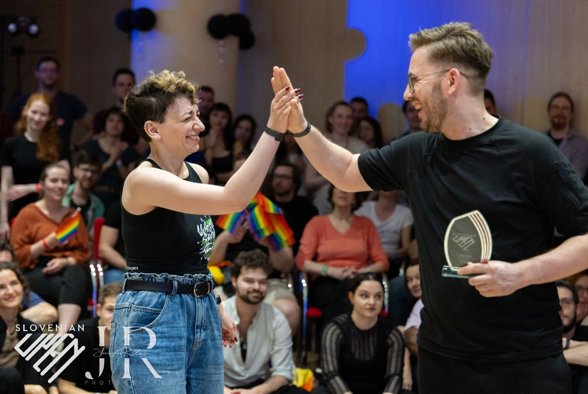

## Dobre prakse

> Ta razdelek prinaša nekaj dobrih praks, ki nam pomagajo pri uspešnem nastopu na tekmovanju.

##### KOREOGRAFIJA? ZAKAJ PA NE\!

::: box
**Zakaj?** Na tekmovanju je veliko dejavnikov, na katere nimamo prav nobenega vpliva. Lahko pa kot *leader* vplivaš na figure, ki jih boš izvajal, in povsem mogoče je, da se v nižjih kategorijah nanje pripraviš že pred tekmovanjem. To te bo pomirilo, tvojemu plesu bo dalo strukturo in te celo pripravilo na to, da boš sposoben uloviti menjavo fraze (*phrase change*). Vse skupaj je sicer v nasprotju s filozofijo *J’n’J* tekmovanj, ampak v začetku je to lahko lepa bližnjica … Če ne prej, te bo ta pristop sicer upočasnil pri napredovanju v kategoriji *intermediate*.

**Kako?** Večina pop glasbe je sestavljene iz fraz, ki zajemajo štiri osmice - 4x8 udarcev = 32 udarcev. Če uspeš v glasbi prepoznati začetek, si lahko potem sestaviš zaporedje figur, ki te bo pripeljalo do menjave fraze, ki jo boš lahko zadel (ne glede na to, ali poslušaš glasbo ali ne). Ker te sodniki gledajo 5-10 sekund, ne bo zares nihče vedel, da ponavljaš enako zaporedje, še tvoj *follower* tega verjetno ne bo ugotovil. Poleg tega lahko v to zaporedje vključiš figure in elemente, ki poudarijo tvoje vrline in sposobnosti (npr. če dobro izvajaš obrate). Te izbrane elemente pa lahko z vajo odlično utrdiš.

**Je bil s tem pristopom že kdo uspešen?** Da! Poznamo tekmovalca, ki se je prebil skozi vse izbirne kroge in na velikem mednarodnem tekmovanju s to taktiko osvojil zelo visoko mesto ter se prebil v kategorijo *intermediate*.
:::

##### STRUKTURA FRAZE ZA LEADERJA

::: box
**Zakaj?** Bolj splošen pristop kakor je piljenje v naprej določene koreografije, je navajanje na posebno strukturo plesa, ki vam pomaga zadeti frazo. Ko imamo to strukturo v podzavesti, se lahko bolje posvetimo tehniki plesa.

**Kako?** Struktura (v novice in intermediate) je npr. naslednja: 2-3 osnovne figure, t.i. *build-up* figura, ki je lahko bolj komplicirana, hkrati pa jo je moč lepo podaljšati, npr. *extended roll-in roll-out*, in pa nastavek za spremembo fraze.
:::

##### NA KAJ MORAM PAZITI …

::: box
**Zakaj?** Pred tekmovanjem smo običajno nemirni. Cel kup dražljajev in informacij nam preprečuje, da bi se osredotočili na stvari, na katere moramo na tekmovanju paziti (o tem več nekoliko kasneje). Običajno je sicer tako, da želimo na tekmovanju plesati čimbolj naravno (s tem bo tudi naše gibanje manj togo in na pogled lepše), je pa dobro, da se pri posamičnih plesih osredotočimo na določene prvine, ki jih bodo iskali sodniki.

**Predpriprava:** Sam običajno poslušam glasbo pri predhodnih skupinah. Kakšen je vrstni red? Predvsem, kdaj pride na vrsto blues? Je prva skladba počasna? Kako hiter je blues? Ima *swung* ritem? Kakšni so žanri predvajanih pesmi?

**Primer mantre - prva pesem (počasna):** “Počakaj na beat. Delayed step. Rolanje - vzmet! Sprejemajoča noga - tonus! Phrase change.”

**Primer mantre - blues:** “Swung ritem? En-in-A-dva. Kick-ball-change. Hitch. Footworki (ponovim svoje 3 klasične v glavi). Kratek frame.”

**Primer mantre - hitra:** “Kratek frame. Jasni trokoraki.”

Količina navodil naj bo majhna. Ena do tri stvari. Več ne, ker vas zmede oz. preobremeni. Zaupajte procesu treninga, da boste nekatere stvari delali že intuitivno (npr. prenos teže, spremembo fraze).
:::

<figure>

<figcaption>Veselje po razglasitvi rezultatov.</figcaption>
</figure>
