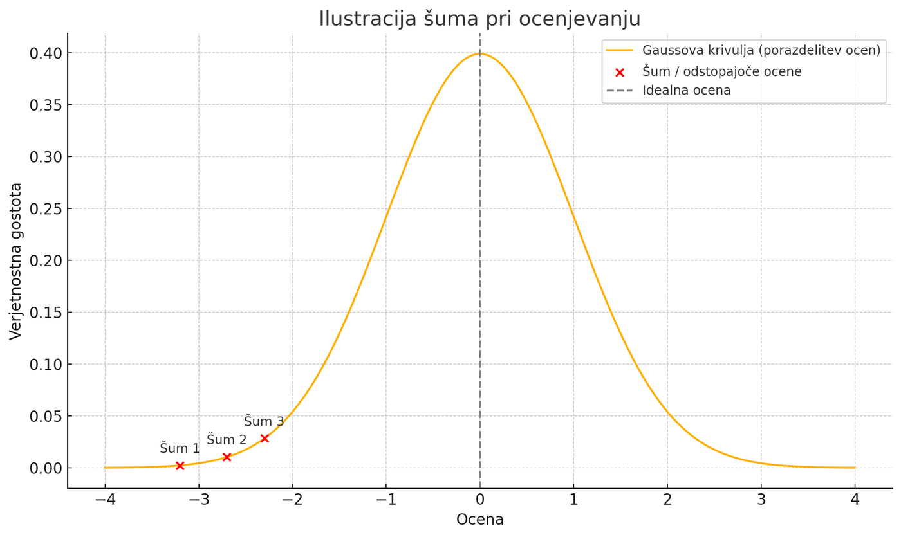
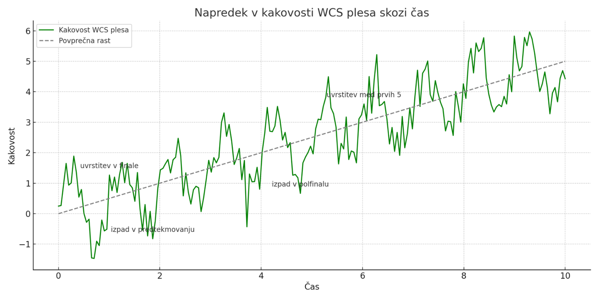
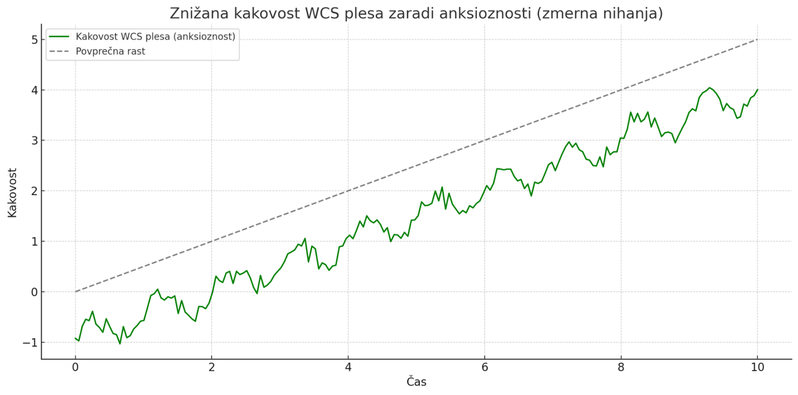
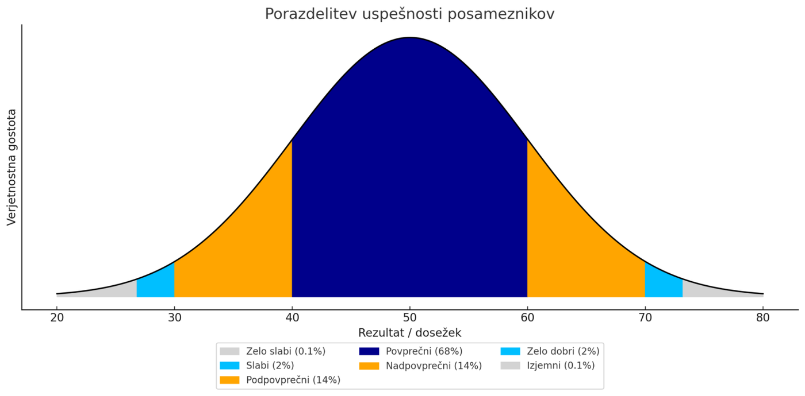
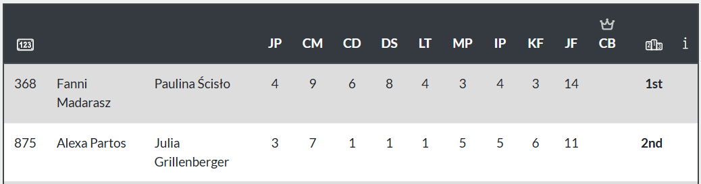

## Kako se soočati z rezultati

> Večina tekmovalcev v west coast swingu ob soočanju z rezultati tekmovanj doživlja občutke razočaranja. Sistem sam deluje tako, da boš večino svoje tekmovalne kariere preživel kot neuspešen tekmovalec.

**VAŽNO\! Ocena, ki jo dobiš na tekmovanju NE ODRAŽA tega, kakšen plesalec si. Prav tako ima ta ocena zelo majhno zvezo s tem, kakšen plesalec si v družabnem plesu.**

#### Vpliv šuma oz. naključij ter pristranskosti

O šumu smo se precej razpisali že v predhodnem poglavju. Identificirali smo sodniški, časovni in naravni šum. Znotraj naravnega smo našteli okoliščine, na katere nimamo vpliva (katerega partnerja in glasbo bomo dobili ter kako močna je konkurenca na dotičnem tekmovanju v naši kategoriji).

Pri sodniškem šumu lahko govorimo celo o pristranskosti. Namreč, Slovenija še ni postavljena na tekmovalni zemljevid WSDC, kar pomeni, da tudi nimamo svojih sodnikov. To pomeni, da nas večinoma ocenjujejo Nemci, Madžari, Avstrijci, Francozi in drugi. Skratka, ljudje, ki prihajajo iz okolij, ki so razvila svoje lastne poudarke pri učenju in razumevanju WCS. To pomeni, da bo tipično Nemec bolje sodil Nemca. Pa ne zato, ker bi bil nujno pristranski do nekoga, ki ga mogoče pozna, pač pa zato, ker se bo tekmovalec v Nemčiji izpopolnjeval v veščinah, ki bodo nemškemu sodniku pomembne.

Druga pristranskost izhaja iz poznanstev. Zdi se, da nas načeloma sodniki, ki nas osebno poznajo ali so z nami plesali ali smo pri njih imeli privatne ure, ocenjujejo bolje kot ostali (ni nujno\!). Če sodnik ve, da plešete dobro, bo nemara spregledal nedoslednost, ki jo bo videl na prvi pogled in vam dal drugo priložnost. Mogoče bo vedel, da določeno veščino obvladate v primerjavi z ostalimi ipd. To se zgodi nezavedno in nekateri sodniki poskušajo to svojo pristranskost naknadno kompenzirati z usklajevanjem ocen.

Pri vlogi šuma pri ocenjevanju si lahko pomagamo s spodnjo sliko, ki prikazuje, da lahko konkretne ocene sodnikov močno odstopajo od idealne ocene našega plesnega znanja.

<figure>

<figcaption>Ilustracija šuma pri ocenjevanju.</figcaption>
</figure>

Denimo, da razporeditev ocen zaradi takega in drugačnega šuma sledi Gaussovi porazdelitvi okrog povprečne vrednosti, ki predstavlja idealno oceno tvojega plesnega znanja. Če bi te ocenjevalo neskočno sodnikov, bi njihova povprečna ocena vestno prikazovala tvoje dejansko znanje. Če bi te en sodnik lahko med tekmovanjem gledal celoten čas plesa, bi njegova ocena vestneje prikazovala tvoje dejansko znanje. Ker pa te ponavadi ocenjuje od 3 do 5 sodnikov in ker te vsak v določenem plesu gleda med 5 in 10 sekundami, so posamezne ocene (kakor tudi njihovo povprečje) podvržene napaki.

Če si npr. celoten ples odplesal s pravilnim timingom, vmes pa si enkrat napravili manjšo napako. Bi lahko pričakovali, da tega ne bo opazil noben sodnik in njihova ocena bi bila pravilna. Kaj lahko pa se zgodi, da so te med to napako opazili kar trije sodniki, kar verjetno že pomeni, da se lahko posloviš od naslednjega kroga.

<figure>

<figcaption>Ilustracija rasti kakovosti plesa in sodniških ocen skozi čas. Povzeto po (Karvinen, 2025).</figcaption>
</figure>

Za večino plesalcev velja, da se s časom veča njihovo znanje in izboljšuje kvaliteta plesa. V povprečju torej postajamo s časom vse boljši plesalci. Rast nemara ni tako linearna, kakor je prikazano na zgornji sliki, vendar se lahko že z analizo svojih lastnih posnetkov skozi čas prepričate, da ste vsako leto boljši. Ocene sodnikov, kot smo pokazali že prej, ne sledijo našemu znanju in so obremenjene s šumom. To pomeni, da se nam lahko npr. že kmalu v začetku plesne poti uspe uvrstiti v finale (ker so nas sodniki mogoče precenili) in da se nam še precej kasneje lahko včasih dogodi izpad v polfinalu ali celo prej.

**Važno: na naključja (šum) nimamo vpliva. Zaradi tega tudi ni smiselno, da se zaradi njih obremenjujemo. Nadziramo lahko samo sebe: kako smo se pripravljali, kako smo plesali na tekmovanju in kako se soočamo z zunanjimi okoliščinami.**

#### Vpliv videza

Ko se odpraviš na nek plesni festival in na letališču čakaš svoje prijatelje, katere druge plesalce najprej prepoznaš? Seveda najprej tiste, ki jih poznaš osebno. Pa potem? Najverjetneje tiste, ki po videzu izstopajo. Po višini, po konstituciji, barvi kože, obraznih posebnostih, po pričeski, oblačilih … Tako delujejo tudi sodniki. Na splošno tako velja, da je večja vpadljivost boljša. Ker na svojo velikost ali raso prav posebnega vpliva nimamo, nekateri veliko stavijo na vpadljiva oblačila in pričeske.

Težko je oceniti, če to pomaga. Gleda na zgoraj napisano pa bi se dalo sklepati, da ima dober vpliv na dolgi rok.

#### Vpliv pričakovanj

Na WCS festivalih redkeje nastopamo kot gledalci (razen na tekmovanjih). Ponavadi smo aktivni plesalci. Svoj ples in ples naših partnerjev dojemamo skozi odnos, povezavo, ki se vzpostavi med plesom. Ker nam je dobra povezava bistvena, se v njej izpopolnjujemo in postajamo vse boljši in boljši. Ta povezava, ki jo ocenjujemo sproti, sčasoma ni več korelirana s tem, kako smo videti navzven, saj na se s tem kot povprečni plesalec nikoli nisem zares obremenjeval.

Če torej lahko z *all star* plesalko odplešem ples, po katerem vidim, da je ona navdušena in če me *novice* plesalke začudeno sprašujejo, kako to, da še vedno tekmujem v njihovi kategoriji, imam torej zmotno pričakovanje, da spadam v višjo kategorijo, saj nisem razvil veščine, pri kateri bi moj ples navzven odražal dinamiko in kvaliteto, ki jo čutim navznoter.

Druge sorte pričakovanj se pojavijo po uspehu na tekmovanju. Npr. osvojil sem prvo mesto v kategoriji *newcomer*, vsi so pohvalili moj ples. Torej pričakujem, da bom v *novice* kategoriji prišel vsaj do finala. Pa se pogosto zgodi, da tak tekmovalec potem izpade že v predtekmovanju, ker so razlike med posameznimi kategorijami res ogromne. Soočenje s tem je lahko včasih za tekmovalce precej težavno.

#### Vpliv samozavesti

Na prejšnji sliki smo videli nihanje v performanci na račun različnih vrst šuma, ki smo jim podvrženi na tekmovanjih. Spodnja slika ponazarja kakovost našega plesa v primeru, ko je na tekmovanju naš ples zaradi nizke samozavesti in anksioznosti precej pod našim siceršnjim nivojem.

<figure>

<figcaption>Vpliv anksioznosti in nizke samozavesti na ocene na tekmovanjih.</figcaption>
</figure>

#### Primerjanje z …

Kolikokrat me je razjedal črv zavisti, ko sem v finalu opazoval tekmovalce, ki so se mi zdeli očitno slabši od mene ali za katere so mi moje soplesalke povedale, da so grozni plesni partnerji. Ni zelo produktivno, malo pa vseeno pomaga, ko kriviš vse okoli sebe za lasten neuspeh.

Vsak od nas ima svojo plesno zgodbo. Nekateri so trenirali ples že kot otroci, drugim je WCS prvi ples in so se z njim srečali šele v zrelih letih. Nekateri so gibalno bolj talentirani (kaj pomeni talent, je itak svoja zgodba), drugim bolj leži razumevanje glasbe, tretji imajo neverjetno sposobnost pomnjenja besedil, četrti pa … so mogoče dobri v matematiki, kar jim prav zelo ne koristi (razen, da takoj razumejo strukturo glasbe in analitične razlage na tečajih). Nekaterim je ples cel svet, drugi se mu posvečajo kot prvi prostočasni dejavnosti, tretjim je samo občasni hobi. Bistvo povedanega je v tem, da vsak od nas z WCS začne na različni točki od koder napreduje z različno hitrostjo. Nekateri po 5 letih plesa prvič nastopijo na tekmovanju, drugi po 2 letih že trkajo na vrata najvišjih kategorij. Nobena od teh poti ni boljša ali slabša. Drži, nekateri so nedvomno boljši plesalci. Ampak to nujno ne pomeni, da v plesu tudi bolj uživajo ali celo, da njihovi plesni partnerji z njimi bolj uživajo. O tem, koliko to zares šteje v življenju in koliko prispeva k splošnemu občutku sreče, pa na tem mestu ne bomo razmišljali. Miselni eksperiment naj napravi bralec sam.

Če se že s kom primerjamo, se dajmo s sabo. Koliko smo napredovali v zadnjem obdobju, koliko smo napredovali od takrat, ko smo prvič stopili na parket. Kako nas dojemajo naši plesni partnerji? Smo prijetni soplesalci? Jih nasmejimo, lahko sledimo glasbenim vložkom, jim pustimo dovolj svobode, da se sami lahko izrazijo skozi ples in da jih ne oviramo?

Če bi že koga tekmovanja morala skrbeti, bi to lahko bili plesni učitelji. Pa še tam lahko naštejemo vrsto razlogov, zakaj so dobri tekmovalni rezultati lahko včasih celo šibkost. Si želimo učiti osnov plesa od nekoga, ki je kot nož skozi toplo maslo zdrsel skozi nižje kategorije? Jaz si tega nujno ne želim, ker nisem prepričan, da je ta tekmovalec na svoji poti (že) osvojil dovolj bazičnega znanja in pridobil dovolj širine v WCS. S svojo gibalno intuicijo je verjetno nadoknadil veliko tistega, kar moramo navadni smrtniki razdelati v potu lastnega obraza. Po drugi strani pa nisem prepričan, da mi bo tak človek znal razložiti, kako naj jaz svoj ples popravim, da bo boljši. Nekdo, ki je hodil po podobni poti kot sem sam, bo nemara bolj primeren učitelj. Seveda pa nič od naštetega ni nujno res. Širina in podkovanost predvsem plesalcev, ki jim je bil ples način življenja že od malih nog, nas pogosto navduši, ko v nekaj sekundah najdejo glavno šibkost našega plesa in nam jasno razložijo, kako jo odpraviti\!

#### Nasičenost v evropskem prostoru

Med epidemijo COVID-19 je v plesnem svetu zazijala luknja. 2 leti ni bilo nobenih tekmovanj, plesalci v določenih skupnostih pa so napredovali z enako hitrostjo kot pred epidemijo. Tako smo sredi leta 2022 naleteli na goro izjemno dobrih plesalcev, ki so tekmovali v za svoj nivo prenizkih kategorijah. Ta naval je upočasnil prehajanje vseh ostalih v višje kategorije in ta manjko se pozna še danes.

Drug dejavnik predstavlja popularizacija WCS na družbenih omrežjih, predvsem na Facebook-u, Instagram-u in TikTok-u. V dveh letih, od 2023 do 2025 je nove točke v WCS osvojilo kar 4000 novih tekmovalcev (in koliko jih v tem času ni uspelo osvojiti točk?), kar je dvakrat več na leto kot v povprečju prejšnih 10 let. WCS je postal zares globalno popularen. Festivali v naši okolici so tako običajno razprodani (nekateri celo v minutah). Število festivalov, ki omogočajo boj za točke, pa je do leta 2025 ostalo praktično nespremenjeno. Tako se zdi, da je čakalna vrsta v kategorijah *newcomer* in *novice*, pa tudi v *intermediate*, vse daljša, nivo plesalcev, ki osvajajo najboljša mesta, pa je izjemno visok, sploh pri *followerjih*. Glede na veliko število novih festivalov, ki so se pojavili z novimi WSDC pravili, se zdi, da se bodo razmerja v naslednjih letih popravila (kar se delno mogoče že pozna med *leaderji* v kategoriji *novice*), vseeno pa se to ne bo zgodilo še prav kmalu in predvsem višje kategorije bodo dlje časa bolj zasičene.

Tretji dejavnik so spremenjena WSDC pravila. Večina tekmovanj v naši bližini v kategoriji *novice* pade v 4\. velikostni red. Do leta 2025 je 15 tekmovalcev v tem rangu dobilo priložnost za nastop v finalu, od leta 2025 dalje samo še 12\. To zaenkrat tudi še upočasnjuje napredovanje.

Četrti dejavnik je vse večja popularizacija tekmovanj v sekundarni vlogi, kar je predvsem težava pri *leaderjih*. Primarni *followerji*, ki tekmujejo v višjih kategorijah, so običajno neprimerljivo tehnično boljši od *leaderjev*. Tako sekundarni *leaderji* večinoma pridejo do finala, vsaj v *novice* kategoriji, in s tem “odvzamejo” mesta primarnim *leaderjem*. Da bi bila stvar še slabša, sekundarni *leaderji* v svojih kategorijah ne vztrajajo samo do osvojenega minimalnega števila točk, ampak pogosto do osvojenega maksimalnega števila točk (kar je 15 več od minimalnega v kategorji *novice* in 30 več v kategoriji *intermediate*). Z novimi pravili pa se je pojavila še ena težava, namreč, v sekundarni vlogi je moč tekmovati 2 kategoriji niže. Se pravi, da se moram kot novice *leader* pomeriti z *advanced followerjem*. Upoštevajoč, da sodniki na tem nivoju gledajo bolj ali manj na tehniko (delo nog in gibanje telesa), to pomeni, da je običajen primarni *novice leader* pogosto že pred nastopom obsojen na neuspeh.

#### Zasnovana za neuspeh

Tekmovanja v WCS so, dokler ne pridete do določenega nivoja (vsaj *intermediate*, še rajši *advanced*) zasnovana tako, da na njih doživljaš neuspehe. Zakaj? Če si dovolj dober, da v *newcomer* kategoriji dosežeš finale, si verjetno preslab, da boš v *novice* prišel do polfinala. Pot do finala v *novice* za običajno talentiranega plesalca traja od nekaj mesecev do nekaj let. Potem pa tipično spet od nekaj mesecev do nekaj let, da pride do kategorije *intermediate*. Poznamo aktivne tekmovalce, ki so za več kot desetletje obtičali v kategoriji *novice*. V tem času je tekmovalec večinoma soočen bodisi z izpadom pred finalom, bodisi s slabim rezultatom v finalu. To pomeni, da bo zaradi samega rezultata v večini primerov razočaran. Bivši tekmovalni plesalec ali profesionalec, bo mogoče preskočil t. i. *novice hell*, ker bodo njegove kvalitete zadostovale do nivoja *advanced*, ampak bo pa potem mogoče porabil veliko časa (in volje), da bo zmogel ponotranjiti vse vsebine, ki jih potrebuje za uspeh v *advanced* in hkrati še tiste vsebine, ki bi jih moral utrditi kot *novice* in *intermediate*, pa jih ni, ker je blestel v drugih plesnih kvalitetah.

<figure>

<figcaption>Ponazoritev tekmovalne konkurence v posamezni kategoriji. Povzeto po (Karvinen, 2025).</figcaption>
</figure>

Gornja slika prikazuje pričakovano porazdelitev tekmovalcev znotraj določene skupine (npr. znotraj skupine *novice leaderjev*). Lahko si predstavljamo, da imamo 68% približno povprečnih tekmovalcev, ter na repih Gaussove krivulje 16% tistih, ki v to skupino po kvaliteti (še) ne spadajo, ter 16% tistih, ki močno presegajo povprečje te skupine.

V primeru, da sodelujemo na tekmovanju, kamor je prijavljenih 100 tekmovalcev v tej skupini (npr. Budafest), to pomeni, da se bo v populaciji znašlo kar 16 takih, ki močno odstopajo od povprečja skupine, kar pomeni, da bodo ti zasedli vseh 15 mest za finale. Če je tekmovalcev 60, ostajata za finale le še 2 “prosti” mesti (od 12), če jih je 30, pa še 3 (od 10).

Skratka, kot tekmovalec boste večinoma soočeni s tem, da boste izpadli pred finalom. Mesec za mesecem, leto za letom. Potem boste imeli krajše obdobje, ko boste mogoče celo pobrali kakšno zmago, ampak boste takoj nato pristali v višji kategoriji, kjer so bo kalvarija ponovila. **Vprašali se boste, vedno znova, zakaj vam je bilo tega treba.**

Zgoraj smo se že srečali z izrazom ***novice hell***, ki označuje obdobje, ko plesalci občutijo rezultatsko stagnacijo in frustracijo. *Novice hell* se nanaša na občutek, da kljub trudu in lastnemu napredku na tekmovanjih ni vidnega rezultata. Plesalci se s časom počutijo ujeti, predvsem ob pogledu na napredovanje (nekaterih) vrstnikov. Poleg tega lahko pomanjkanje povratnih informacij (s strani sodnikov) in subjektivnost ocenjevanja še dodatno prispevata k občutku nemoči.

Da bi preživeli to obdobje, se morajo plesalci osredotočiti predvsem na svoj lasten napredek, ki se meri z obvladovanjem plesne tehnike (v nasprotju s primerjavo z ostalimi). Pomembno je tudi, da plesalci ostanejo motivirani in si zastavijo dobre cilje. Udeležba na delavnicah, iskanje povratnih informacij od izkušenih učiteljev (in sodnikov) ter redna vadba lahko pripomorejo k premagovanju *novice hell* in nadaljnjemu plesnemu razvoju.

### Kako preživeti *novice hell*?

> Kako od tekmovanj dobiti največ za svoj lastni ples? In kako preživeti ob ponavljajočih se slabih rezultatih?

##### NAMEN

Najprej moramo pri sebi jasno razdelati, zakaj plešemo. Nekaj idej … Ker nam je ples kot tak všeč, ker nam ponuja možnosti izražanja, komunikacije, ki je sicer drugje nimamo. Ker si želimo pripadati. Ker imamo tu prijatelje. Ker spoznavamo nove ljudi. Ker nas gibanje v povezavi z glasbo osrečuje. Podobno kot glede vzrokov za sam ples, se moramo vprašati tudi o vzrokih, zaradi katerih tekmujemo. Spet nekaj idej … Ker si želimo zunanje potrditve. Ker bi radi postali plesni učitelji in ker dobra ocena na tekmovanju prinese določeno mero verodostojnosti. Ker želimo premagati svoj strah pred javnim nastopanjem. Ker nas v to posredno sili pripadnost skupnosti, v kateri vsi tekmujejo. Ker želimo več znanja, ki je skrito v višjih vadbenih skupinah.

Vsak ima svoje odgovore na zgornja vprašanja. Pomembno je, da jih v času, ko so stvari težavne, občasno prikličemo v spomin. Vsak si mora namreč sam osmisliti, zakaj pleše in zakaj tekmuje.

::: box
**Zakaj sploh tekmovati?** Ples je izrazito družabna dejavnost in ne potrebuje nobenih tekmovanj. Vsak od nas pa lahko išče motivacijo zunaj (šibkejša) ali znotraj (močnejša).

**Zunanja spodbuda:** Če želim napredovati, moram imeti priložnost udeležiti se delavnic za nivo, ki ustreza mojemu znanju oz. je malenkost višji. Za to običajno potrebujem WSDC točke. Če grem na 2-3 festivale na leto, je sicer zelo verjetno, da mi nivo, na katerega se prijavljam, povsem ustreza, če pa sem reden obiskovalec, potem pa se mi tematike z leti počasi že ponavljajo.

**Notranja spodbuda:** WCS premore večje število kvalitetnih plesalcev kot ostale zvrsti družabnih plesov. Vsaj na mednarodnih festivalih. Razlog za to tiči prav v tekmovanjih. Tekmovanja nas spodbujajo, da presežemo lastne okvire dojemanja plesnega užitka in se bolj intenzivno posvetimo tehniki in videzu našega plesa.

**Si želim plesno na tak način napredovati?** Ko gledam plesalce v višjih kategorijah, lahko jasno vidim, v čem vse so boljši od mene (in ja, tudi sam si želim nekoč tako plesati) in glede tega vsaj delno zaupam, da me bo sistem pripeljal do cilja.
:::

##### SAMOPODOBA

Plesna samopodoba je lahko zavajajoča tako v negativno (predvsem na račun slabih ocen na tekmovanjih), kakor tudi v pozitivno smer. Samega sebe med plesom ne gledamo, ne vidimo. Svoj ples običajno dojemamo skozi partnerjev odziv, ki je največkrat pristransko pozitiven. Naši partnerji so pač prijazni, naša povezava z njimi, predvsem s tistimi, s katerimi več plešemo in smo nanje bolje navajeni, pa je boljša od tega, kako izgleda navzven. Normalno\! Plesno povezavo treniramo, izboljšujemo, negujemo, v ogledalu ali na videu pa se običajno redko in zelo neradi gledamo.

::: box
**Zmotno negativna samopodoba**

Ocene na tekmovanjih me NE definirajo. Ocene na tekmovanjih me ne definirajo kot plesalca, še manj kot človeka. So samo neka precej negotova ocena, kako so me konkretni sodniki videli na konkretnem tekmovanju.
:::

::: box
**Zmotno pozitivna samopodoba**

Ali moram razmisliti o svoji plesni tehniki? WCS je izrazito progresiven ples. Kar velja za sveto na tečaju prve stopnje, je premalo na tečaju druge stopnje in mogoče celo narobe na tečaju tretje stopnje. Ali resnično poznam tehniko, ki jo moram obvladati, da bi me sodniki pozitivno ocenili? Sem jo pridobil v zadnjem obdobju ali je to nekaj, česar se spomnim izpred desetletja? Če tehniko poznam, ali jo znam tudi izvajati? Ali vem, kaj sodniki dejansko hočejo videti? Ali se zavedam, da sodniki v *novice* ne ocenjujejo kompleksnosti figur, ki jih izvajam? Ali vem, da moram poleg tehnike biti kot *leader* pozoren tudi na strukturo glasbe in biti sposoben pokazati spremembo fraze v glasbi? Ali imam objektivno podobo o svojem plesu na tekmovanju? Ali sem preveril lastne posnetke s tekmovanja? Sem jih primerjal s sotekmovalci? Ali opazim kakšne napake? Sem posnetke pokazal svojemu učitelju, mentorju ali komu tretjemu? Ali sem prepričan, da je bil moj timing dober (slab timing pomeni skoraj avtomatičen izpad)?
:::

##### KONSTRUKTIVEN PRISTOP

Nihče še ni postal vrhunski plesalec od danes na jutri. V razvoj svoje veščine je moral vložiti na tisoče ur treninga. Gre za maraton in ne za sprint. Pa tudi sprinterji so morali do svojega rezultata priti z “maratonskim” procesom. Če si motiviran, si pripravi načrt in ga potem, korak za korakom, začni izpolnjevati. S treningom boš postal sicer res primarno odličen tekmovalni plesalec, ampak, če boš dobro poslušal, boš spotoma postal tudi tisti družabni plesalec, s katerim bodo z veseljem plesali vsi.

::: box
**Nekaj konstruktivnih idej …**

**Tečaj WCS plesne tehnike.** V Ljubljani imamo na voljo več tečajev (ali delov tečajev) plesne tehnike, ki učijo veščin, ki so specifično koristne na tekmovanjih v novice kategoriji (npr. delayed weight transfer, partial-full-delayed triple step ipd.).

**Načrt osebnega napredka in sprotno spremljanje.** Z mentorjem ali učiteljem lahko na privatni uri določita načrt napredovanja, ki bo zarisal vsebino treninga s ciljem osvojiti točke/višja mesta v določeni kategoriji. Pri sestavi načrta si lahko pomagaš s tem priročnikom.

**Privatne ure ali videoanalize s sodniki.** Kot smo že omenili, ni splošnega pravila, kaj je potrebno znati za dobre ocene na tekmovanju. Splača se o tem povprašati sodnike same, sploh, če jih poznaš osebno. Do njih lahko pristopiš zelo direktno in jih prosiš, če ti lahko pomagajo izboljšati se do te mere, da bi bil tvoj ples dovolj dober za njih na tekmovanju. Velikokrat boste slišali podobne nasvete, ki bodo - večkrat slišani - dobili večjo težo, včasih pa ti lahko kakšen od sodnikov razširi obzorje in pokaže na nekaj, česar se v resnici sploh nisi zavedal.
:::

##### SKUPNOST

V dveh letih in pol, kolikor sem stalen gost na tekmovanjih, sem srečal že ničkoliko obrazov. In ti obrazi pogosto gredo “mimo mene”, kar pomeni, da so nekoč startali s precej slabšim znanjem, kot sem ga v tistem trenutku imel sam, me dohiteli, prehiteli in se mi zdaj smehljajo v finalih v višjih kategorijah. Ti ljudje običajno pripadajo eni od dveh skupin: (a) so bivši tekmovalni plesalci ali (b) prihajajo iz okolij, kjer je WCS precej bolje razvit (npr. Dunaj, Budimpešta, München, Brno, Erding). No, obstaja še (c) tretja skupina, pri kateri gre za plesalce, ki so bolj učljivi (in ponavadi tudi precej mlajši) in plesno bolj talentirani (npr. kar nekaj jih je v sosednjem Grazu, kjer imajo sicer tudi dostop do advanced/all star učiteljev).

::: box
**Ljubljana ni Dunaj.** Naša plesna skupnost je sicer relativno velika, ne premore pa (še) veliko kvalitetnih plesalcev. Če izvzamemo naše *intermediate+* plesalce in profesionalne učitelje, je mogoče peščica ob ugodni poravnavi planetov sposobna priti do finala v *novice* kategoriji. To je tudi nivo plesa na naših družabnih dogodkih. Skozi to prizmo je zato še toliko več vreden vsak uspeh, ki ga kdorkoli od naših tekmovalcev doseže. Na drugi strani pa se bo vsak osebni napredek zrcalil tudi v skupnosti in bolj kot bomo napredovali kot skupnost, lažje bodo napredovali naši člani. Zdi se, da velja mušketirski moto: vsi za enega, eden za vse.
:::

::: box
**Tekmovanje mi predstavlja prevelik pritisk.** Obstaja alternativa, da bi lahko sodeloval na naprednejših delavnicah? Obstajajo plesalci, ki jim tekmovanja predstavljajo prevelik psihološki pritisk. Kljub temu so postali fenomenalni plesalci in jih lahko vidimo na festivalih v (naj)višjih skupinah. Večina festivalov omogoča, da jim posamični plesalci pošljejo priporočilo lokalnega ali tujega plesnega učitelja, ki jamči, da bo plesalec sposoben tvorno sodelovati pri delu skupine. *Kljub temu velja poudariti, da imamo v Sloveniji z razlogom samo 5 (+2) tekmovalcev v kategoriji intermediate+ in zelo majhno število plesalcev z nekaj novice točkami. Se pa zdi, da se bo to kmalu spremenilo.*
:::

##### NA DRUGI STRANI …

Pomembno je razumeti tudi, kaj se zgodi, ko po dolgotrajnem mučenju v nižji kategoriji, končno napreduješ in se poskusiš v višji kategoriji. Ker ponavadi v višji kategoriji spet obstaneš v predtekovanju, se zaveš, da je napredek relativen. Obdobje, ki si ga preživel v nižji kategoriji, si izkoristil za lasten napredek, ki je nujno potreben tudi, da se v višji kategoriji pomakneš naprej. Dokaj vseeno je, kje to počneš: *novice, intermediate, advanced*. Drugo opažanje je, da so nekateri sotekmovalci, za katere nisi razumel, zakaj so napredovali, v vsem tem obdobju obstali v preddverju višje kategorije in jim zdaj na rezultatih pogosto pokažeš hrbet. Tudi v tem se kaže vpliv šuma na rezultate in nam tako osvetli in omogoči še boljše razumevanje zgoraj zapisanega. V spodobnostih in pri naključjih, s katerimi omrežimo sodnike, si nismo enaki. Ko v finalu v kategoriji *intermediate* zmaga oseba, pri kateri znotraj enega plesa ne opaziš niti enega zakasnjenega prenosa teže, se vprašaš o smiselnosti celotnega tekmovalnega sistema v WCS. Skozi celoten priročnik poskušamo osvetliti naključja, ki botrujejo rezultatom \- v pozitivni ali v negativno smer. Temu se res ne da izogniti, in kolikor je že izrabljeno, v vsakem trenutku velja, da smo sami krojači lastne usode. Vse, kar lahko storimo, je, da postanemo boljši plesalci.

### Razumevanje ocen in vrstnega reda

> Točkovalni sistemi v finalih in izbirnih krogih so včasih neintuitivni. Kako na podlagi ocen razumeti, kdo je boljši?

##### *CALLBACK* SISTEM V IZBIRNIH KROGIH

::: box
**Uporablja se v izbirnih krogih:** *Callback* sistem služi izbiri najboljših tekmovalcev v izbirnih krogih (od predizbora do polfinala).

**Število sodnikov:** v izbirnih krogih morajo posamično vlogo ocenjevati vsaj 4 sodniki in glavni sodnik. Na večjih tekmovanjih (rang 5 ali 6) WSDC priporoča vsaj 5 sodnikov. Za nižje range tekmovanj (1-3) WSDC po novem izjemoma dovoljuje, da posamezni sodnik ocenjuje obe vlogi. Še vedno se zahteva vsaj 4 ocene na vlogo.

**Ocenjuje se posameznika:** V izbirnih krogih sodniki ocenjujejo posameznika in ne para. To včasih pomeni, da se tekmovalcu izplača določene stvari (npr. timing) početi neodvisno od partnerja. Če zares želimo tako plesati, je seveda drugo vprašanje.

**Ocene posamičnega sodnika:** Posamični sodnik lahko da tekmovalcu naslednje ocene s pripadajočo številsko vrednostjo: *Yes (10 točk), No (0 točk), Alt1 (4.5 točke), Alt2 (4.3 točke), Alt3 (4.2 točke).* Ocene so oblikovane tako, da sta dve “alt” oceni vredni manj kot ena ocena “Yes”.

**Opomba:** Kljub temu, da se v naši okolici uporabljajo 3 “alt” ocene, njihova uporaba ni predpisana. Načeloma se več “alt” ocen uporablja pri večjih tekmovanjih z namenom zmanjševanja izenačenih rezultatov.

**Skupna ocena in vrstni red:** Skupna ocena posameznika se izračuna kot vsota točk vseh sodnikov. V primeru izenačenega števila točk tekmovalcev na meji napredovanja, se za določanje vrstnega reda upošteva ocena glavnega sodnika, ki oceni vse tekmovalce.

**Število tekmovalcev v skupinah:** V izbirnih krogih število parov/tekmovalcev v skupinah ni zares predpisano. Smernice je možno razbrati iz tabel glede števila tekmovalcev in predpisanih krogov in implicitnega razumevanja, da obstajata 2 polfinalni skupini in 4 četrtfinalne. Zdi se, da je minimalno število tekmovalcev v predtekmovalni skupini za večje dogodke (vsaj rang 4) okrog 15 tekmovalcev, največje število pa je ponavadi omejeno na približno 25.
:::

##### OCENJEVANJE V FINALU (RELATIVNA UVRSTITEV Z VEČINSKIM KONSENZOM)

::: box
**Ocenjuje se par:** V nasprotju z izbirnimi krogi, se v finalu ocenjuje par. Uvrstitev posameznika je torej odvisna tudi od dodelitve partnerja, pomembnejšo vlogo kot v izbrnih krogih pri tem dobi tudi dinamika v paru, komunikacija ipd.

**Število sodnikov:** V finalu mora par ocenjevati vsaj 5 sodnikov (in glavni sodnik). Pri višjem rangu tekmovanj (5 ali 6) je potrebno zagotoviti vsaj 7 sodnikov.

**Število tekmovalcev v skupinah:** Število tekmovalcev v finalu lahko določi organizator, običajno pa je omejeno na dobitnike točk glede na rang tekmovanja.

**Ocene posamičnega sodnika:** Posamični sodnik oblikuje svoj vrstni red parov, se pravi vsak par oceni z mestom, na katerega misli, da par spada.

**Skupna ocena in vrstni red:** Končni vrstni red v finalih *Jack and Jill* temovanj je ena najbolj slabo razumljenih in neintuitivnih stvari v west coast swingu, zato si njeno razumevanje zasluži še posebno pozornost. V grobem velja, da nas zanima, kako je določen par ocenila večina sodnikov (vsaj na katero mesto ga je postavila, kar ni enako povprečju!). Na podlagi vrstnega reda teh relativnih mest se potem izoblikuje končni vrstni red.
:::

Zelo poučen je naslednji primer iz kategorije *novice* na Budafestu 2025:

<figure>

<figcaption>Prva dva para v kategoriji novice na Budafest 2025. Vir: scoring.dance.</figcaption>
</figure>

Na prvi pogled se zdi, da je drugouvrščeni par dobil boljše ocene. Intuitivno nas bode v oči predvsem to, da je povprečje ocen drugega para precej višje od prvega. Primerjalno so samo 3 ocene od 9 pri prvem paru boljše kot pri drugem. Zakaj je torej vrstni red takšen kot je?

Kategorijo je ocenjevalo 9 sodnikov. Večino torej predstavlja 5 sodnikov. Zanima nas naslednje. **Koliko sodnikov je para ocenilo na določeno mesto ali višje (in kdaj je šlo za večinski konsenz)?**

* 1\. mesto \- prvi par: 0, drugi par: 3
* 2\. mesto \- prvi par: 0, drugi par: 3
* 3\. mesto \- prvi par: 2, drugi par: 4
* 4\. mesto \- **prvi par: 5**, drugi par: 4 (prvi par ima večinski konsenz, da si zasluži vsaj 4\. mesto, medtem ko ga drugi par nima; zato je prvi par rangiran više od drugega)
