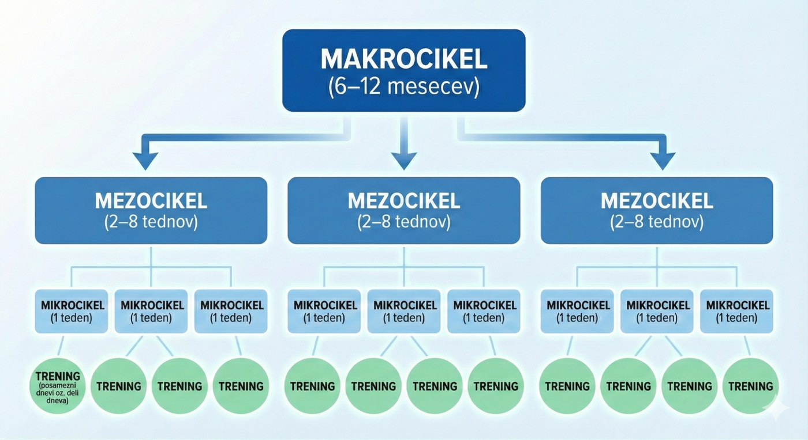

## Načrtovanje treninga

### Lastnosti WCS

> Da lahko nek šport efektivno treniramo, moramo poznati njegove karakteristike. Včasih takšnemu pregledu pravimo tudi anamneza športne panoge oz. discipline.

##### KONDICIJA IN MOČ

Plesalec mora biti sposoben tedensko plesati od 10-20 ur. Večino tega časa pleše rekreativno, del čas posveti tečajem, del samostojnemu treningu. Velik pomen ima moč, ki služi obvladovanju telesa. Potrebno je imeti razvite mišice trupa (core), ki služijo stabilnosti in ravnotežju. Veliko dela je na stopalih, potrebno je biti sposoben kontrolirano prenašati težo ob “rolanju” stopal. Potrebno je držati trden okvir, kar pomeni: mišice rok imajo sicer tonus, niso pa napete, večino držimo z mišicami na hrbtu, rama ostaja zadaj (nikoli je ne “damo” soplesalcu), s čimer skrbimo za konstantno povezavo med plesalcema. *Followerji* pogosto izvajajo elemente, pri katerih se spustijo nizko v kolenih in se morajo biti pogosto sposobni sami (in večkrat) dvigniti. Na drugi strani morajo leaderji biti sposobni do neke mere obvladati težo plesalke.

::: box
Moč trupa: Močan trup pomeni večjo stabilnost, boljše obvladovanje ravnotežja. Moč nog in vztrajnost v moči: Večina plesnih zabav (sploh na festivalih) traja od 2 do 8 ur. Plesalec mora biti sposoben preživeti čimveč časa aktivno na nogah, pri čemer je pomembno, da lahko stegenske mišice uspešno prenesejo obremenitev. Prav tako je dobro, če je plesalec sposoben daljši čas plesati aktivno (prenosi teže in rolanje, da se med takšnim plesom ne priuči slabih navad, ki mu škodujejo na tekmovanju).
:::

### Določanje (tekmovalnih) ciljev

> Marsikateri plesalec tedensko preživi več kot 3 ure na tečajih, več kot 3 ure na preplesavanjih in več kot 5 ur na plesnih zabavah. To je skupaj v povprečju približno 1 uro in pol na dan, marsikateri med nami pa plesu posveča tudi 2-3x več časa. Če se primerjamo z npr. rekreativnimi tekači, namenimo mi našemu športu zelo veliko časa.

Večina tega časa je sicer namenjena nestrukturirani vadbi, plesu za užitek. Če pravilno pristopimo, lahko tudi od tega plesa odnesemo ogromno, bodisi z osvajanjem znanja s pomočjo svojih vrstnikov, bodisi s fokusom na določeno plesno tematiko. Lahko se osredotočimo na eno od tehnik, ki jih poskušamo osvojiti ali utrditi, osvajanju novega znanja ipd.

**Primer 1:** Med družabnim plesom opazujemo svojega partnerja pri izvajanju footworkov, okraskov ali musicality poudarkov. Ko opazimo kaj zanimivega, poskusimo to ponoviti. Ta način plesa je lahko tudi zelo zabaven in spodbuja dodatno komunikacijo med partnerjema.

**Primer 2 (za *leaderja*):** Med družabnim plesom se fokusiramo na trening musicalityja, kar bodo naši plesni partnerji dobro sprejeli. Med plesom poskusimo prepoznati strukturo (osmice, fraze), poskusimo se orientirati v kateri osmici znotraj fraze se trenutno nahajamo, poskušajmo predvideti spremembo fraze in energijo in dinamiko spremembe fraze (bo šla navzdol, bo šla navzgor, bo nenadna, počasna).

**Primer 2 (za *followerja*):** Med družabnim plesom se fokusiramo na *micromusicality*. Poskušamo zaznati npr. ponavljajoče ritmične ali melodične elemente. Poskusimo jih predvideti in poudariti z izolacijami.

Redno sodelujemo na plesnih tečajih (ki naj bi bili prilagojeni naši ravni). Pri postavljanju ciljev nam bodo najbolj v pomoč privatnih ure z učitelji, cilje pa bomo najbolj učinkovito dosegli s fokusiranim individualnim treningom. Vse tri oblike vadbe so opisane na koncu tega poglavja.

#### Cilji

V nekem trenutku, običajno je to začetek plesne sezone, ki ga lahko postavimo na september, je potrebno oblikovati cilje za prihajajoče obdobje. Dobre cilje oblikujemo po sistemu SMART (in po njegovih nadgradnjah ter dopolnitvah SMARTER in CLEAR). Osnovne definicije so podane v spodnjih tabelah.

<table>
<caption>Merila SMART</caption>
<thead>
<tr><th scope="col">Črka</th><th scope="col">Pomen</th><th scope="col">Pojasnilo</th></tr>
</thead>
<tbody>
<tr><th scope="row">S</th><td>Specific (Specifičen)</td><td>Cilj mora biti jasen, natančen in osredotočen na eno stvar.</td></tr>
<tr><th scope="row">M</th><td>Measurable (Merljiv)</td><td>Napredek mora biti kvantificiran oziroma opazno ocenljiv.</td></tr>
<tr><th scope="row">A</th><td>Achievable (Dosegljiv)</td><td>Cilj mora biti realističen glede na zmogljivosti in vire.</td></tr>
<tr><th scope="row">R</th><td>Relevant (Pomenljiv)</td><td>Cilj mora biti skladen z večjimi osebnimi ali športnimi cilji.</td></tr>
<tr><th scope="row">T</th><td>Time-bound (Časovno določen)</td><td>Cilj mora imeti jasen rok za izpolnitev.</td></tr>
</tbody>
</table>

<table>
<caption>Razširitev v SMARTER (dodatni merili)</caption>
<thead>
<tr><th scope="col">Črka</th><th scope="col">Pomen</th><th scope="col">Pojasnilo</th></tr>
</thead>
<tbody>
<tr><th scope="row">E</th><td>Evaluate (Ovrednoti)</td><td>Cilje je treba <strong>redno preverjati</strong>, meriti napredek in ocenjevati učinkovitost.</td></tr>
<tr><th scope="row">R</th><td>Readjust (Prilagodi)</td><td>Cilje je treba <strong>prilagoditi</strong>, če se pojavijo spremembe ali ovire, da ostanejo smiselni in izvedljivi.</td></tr>
</tbody>
</table>

<table>
<caption>Merila CLEAR</caption>
<thead>
<tr><th scope="col">Črka</th><th scope="col">Pomen</th><th scope="col">Pojasnilo</th></tr>
</thead>
<tbody>
<tr><th scope="row">C</th><td>Collaborative (sodelovalni)</td><td>Cilji se postavljajo skupaj s trenerjem, ekipo ali partnerjem. Gradijo timsko delo in podporo.</td></tr>
<tr><th scope="row">L</th><td>Limited (omejeni)</td><td>Cilji morajo biti jasno omejeni v obsegu in času, da se jih da učinkovito doseči.</td></tr>
<tr><th scope="row">E</th><td>Emotional (čustveni)</td><td>Cilj mora biti povezan z osebnimi vrednotami ali strastjo — to krepi notranjo motivacijo.</td></tr>
<tr><th scope="row">A</th><td>Appreciable (vredni)</td><td>Cilji so razdeljeni na manjše, dosegljive korake, ki jih lahko postopno uresničuješ.</td></tr>
<tr><th scope="row">R</th><td>Refinable (prilagodljivi)</td><td>Cilji niso togi – če se pogoji spremenijo, jih lahko sproti prilagajaš.</td></tr>
</tbody>
</table>

V plesu se sistema SMART(ER) in CLEAR dopolnjujeta. Prvi sistem zagotavlja stukturiranost, logičnost in jasne cilje, osredotočen je na merljivost in realnost (odličen za pripravo na Jack and Jill v nižjih kategorijah, kjer je poudark na individualni tehniki). Drugi sistem zagotavlja prilagodljivost, vključuje čustveno komponento in dinamično okolje, osredotočen je na motiviranje in sodelovanje (primernejši je za umetniške in skupinske cilje, npr. pripravo rutin, strictly).

Več o oblikovanju konkretnih plesnih ciljev si preberite v razdelku o privatnih urah (spodaj).

### Ciklizacija treninga

> V vrhunskem športu se trening izvaja v različnih fazah ali ciklih. Ciklizacija se dogaja znotraj sezone ali celo v manših časovnih enotah. Celotna struktura treninga je običajno vezana na glavne tekmovalne cilje, ki pa jih pri WCS dejansko v splošnem nimamo, še najbolj se zdi, da bi lahko rekli, da je poletje čas, ko velja ples dati nekoliko na stran.

Namen ciklizacije je **preprečevanje preobremenitev**, **optimizacija forme** in **ohranjanje ustvarjalne svežine**. Tega sicer plesalci v WCS ponavadi ne počnejo, ampak \- lahko poskušimo s svežim pristopom.

#### Cikli

V teoriji poznamo naslednjo hierarhična struktura vadbenih enot oz. ciklov.

<figure>

<figcaption>Ilustracija razdelitve posameznih podciklov in treningov znotraj enega makrocikla.</figcaption>
</figure>

Z delom v makrociklih, bi nemara na nek način lahko celo vplivali na to, kako dojemamo svoje rezultate na tekmovanjih. Npr. v začetku vadbenega makrocikla ne moremo računati na dobre uvrstitve na tekmovanjih, saj se tam osredotočamo verjetno na bolj specifične tematike, ki ponavadi niso dovolj za tekmovalni uspeh. Ko v enem od zadnjih mezociklov naredimo sintezo osvojenega, lahko z večjo verjetnostjo pričakujemo, da bo naš ples bolj celosten in zato tudi bolje sprejet pri sodnikih.

##### MAKROCIKEL

::: box
**Cilji:** En makrocikel treninga naj zaobjema dosego enega tekmovalnega cilja. Taki tekmovalni cilji so lahko: (1) preboj v finale newcomer, (2) preboj v finale novice, (3) dobra uvrstitev v finalu novice, (4) preboj v finale intermediate ipd.

**Trajanje:** Plesna sezona v WCS traja čez vse leto. Festivali so približno enakomerno porazdeljeni čez vse leto. Trajanje makrocikla naj bo prilagojeno zahtevnosti cilja. Npr. finale newcomer (6 mesecev), finale novice (1 leto), dobra uvrstitev novice (6 mesecev), finale intermediate (1 leto) ipd.

**Počitek:** Vsak makrocikel naj se zaključi z obdobjem počitka, sprostitve oz. odmika od tekmovanj. S tem se bodo naši tekmovalni in plesni apetiti dvignili, prav tako pa tudi ne bomo pozabili na druge radosti življenja. Tudi sicer velja v športu modrost, da je počitek glavni del vsakega treninga.

**(Ne) doseganje cilja:** Kljub treningu bomo nek cilj dosegli ali pa ne. Pri slednjem je dobro, če znamo v budistični maniri izpustiti lastna pričakovanja, se sprijazniti s stanjem in temu istemu cilju nameniti še en makrocikel. In še enega, če je treba.
:::

##### MEZOCIKEL

::: box
**Pripravljalni mezocikel:** Makrocikel odpremo z bazičnimi pripravami. V kategoriji newcomer bi to pomenilo, da poskusimo čim dlje plesati osnove, s katerimi bomo osvojili ritem ter osnovne figure. V višjih kategorijah (npr. intermediate), bi v tem delu priprav lahko več časa posvetili kondiciji in moči. V tem obdobju lahko določimo tudi vsebino za razvojni mezocikel.

**Razvojni mezocikel:** To je bistveni del našega makrocikla, v katerem bomo razvijali predvsem tehniko, ki je potrebna za dosego našega cilja. Primer za makrocikel, v katerem želimo doseči novice finale: vadba delayed korakov, partial-full-delayed, drže in okvira, postavljanja stopal (turnout), rolanja stopal, pitch/poise. V tem obdobju se posvetimo predvsem tehničnim treningom (sami doma, Minimundo, preplesavanja).

**Posebni mezocikel → sintezni mezocikel:** Pred aktivnim tekmovalnim obdobjem je dobro en del časa posvetiti sintezi naučenega, povezati vse tehnike med sabo. V tem obdobju so zelo koristne simulacije tekmovanj, ki izpostavijo morebitne pomanjkljivosti (npr. novice tekmovalni treningi).

**Tekmovalni mezocikel:** V tem obdobju si določimo nekaj glavnih tekmovanj, na katerih želimo doseči rezultate. Nadaljujemo s treningi iz sinteznega mezocikla. Del cikla posvetimo tudi mentalni pripravi. Glede na (ne) doseganje rezultata skrajšamo ali podaljšamo ta cikel. Če smo npr. dosegli novice finale, lahko to utrdimo na več tekmovanjih. Kasneje pa nato začnemo krajši makrocikel, ki nas bo pripeljal do višje uvrstitve v finalu (pri leaderjih se tu predvsem trenira strukturiranje plesa).

**Prehodni mezocikel:** Prehodni mezocikel je namenjen regeneraciji in psihofizični sprostitvi. Ukvarjamo se z drugimi dejavnosti/športi, plešemo predvsem za užitek in družabno, za nekaj časa pozabimo na trening.
:::

##### MIKROCIKEL

::: box
**Tedenski program:** Mikrocikel ni nič drugega kot tedenski načrt treninga.

**Primer za newcomer:**

- **Ponedeljek-petek:** vaje za ravnotežje, core in gležnje med umivanjem zob, 5-10 min
- **Torek:** tečaj tehnike in vsebin primernih za newcomer nivo, 2h
- **Ponedeljek, sreda, petek:** trening delayed stepa (poudarek na 4) doma - solo, 30 min
- **Sreda:** fitnes - poudarek na rokah in zgornjem delu hrbta
- **Četrtek:** fokusiran trening v Minimundo - delayed step v intervalih 6x 10 min (delayed na 4, na 1, na 4, na 1, nato 2x oboje), med vsakim intervalom kratka pavza, 1h30
- **Sobota:** prvi del partyja vadim delayed na 1 in 4, 1h
  :::
