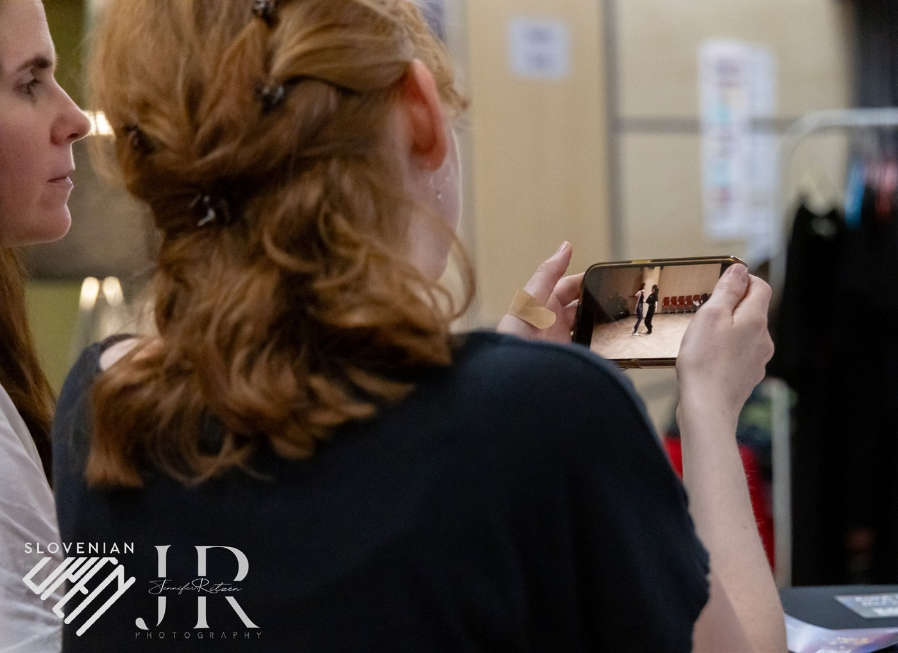

## TEČAJI

### Vrste in namen tečajev

> Kratek opis, ki vam pomaga izbrati prave tečaje.

#### Tečaji po stopnjah

Različne plesne šole si različno predstavljajo izvedbo tečajev po stopnjah. Nekatere plesne šole na tečaju po stopnjah uskladijo podajanje tehnike in horizontalnih vsebin. Druge plesne šole se osredotočajo predvsem na horizontalne vsebine (npr. na nove figure). Če želite tekmovalno napredovati, vam svetujemo, da obiščete tečaje, kjer boste izvedeli tudi kaj o tekmovalni WCS tehniki.

##### WCS 1

::: box
**Kdo?** Tečaj je namenjen začetnikom, ki se prvič spoznavajo z WCS.

**Kaj?** Vsebina zajema predstevitev WCS ritma, koraka, trokoraka, osnovnih 6-dobnih figur, osnovnih 8-dobnih figur (whipi) in še kakšno kratko vsebino iz povezave med plesalcema in tehnike.

**Koliko časa?** Ta tečaj v osnovni različici traja 2 meseca.
:::

##### WCS 2

::: box
**Kdo?** Tečaj je namenjen plesalcem, ki so opravili 1\. stopnjo in se zdaj pripralvjajo na nastop v newcomer kategoriji.

**Kaj?** Piljenje osnov in počasno uvajanje naprednih konceptov (delayed step, povezava, poudarki v glasbi, obrati), uvajanje nekaterih naprednejših figur (npr. roll-in roll-out).

**Koliko časa?** Ta del običajno traja od 4 do 8 mesecev. Odvisno od šole.
:::

##### WCS 3

::: box
**Kdo?** Tečaj je namenjem plesalcem, ki se pripravljajo na nastope v novice kategoriji.

**Kaj?** Tečaj prinaša seznanjanje in piljenje vseh tehnik, ki so potrebne v novice kategoriji (na naprednejšem nivoju kot WCS 3), trening makro in mikro musicality ter napredne figure.

**Koliko časa?** 1-3 leta.
:::

##### WCS 4

::: box
**Kdo?** Tečaj je namenjen plesalcem, ki se borijo za dobre uvrstitve v novice kategoriji ali finale v intermediate.

**Kaj?** Poleg vsebin z WCS3, več poudarka na kvaliteti gibanja, tekmovalni tehniki, nekaj naprednih figur.

**Koliko časa?** 1-5 let.
:::

Stopnje tečajev so usklajene s težavnostjo na srednje velikih festivalih (okrog 300 ljudi). 

<figure>

<figcaption>Skupinski tečaj WCS.</figcaption>
</figure>
