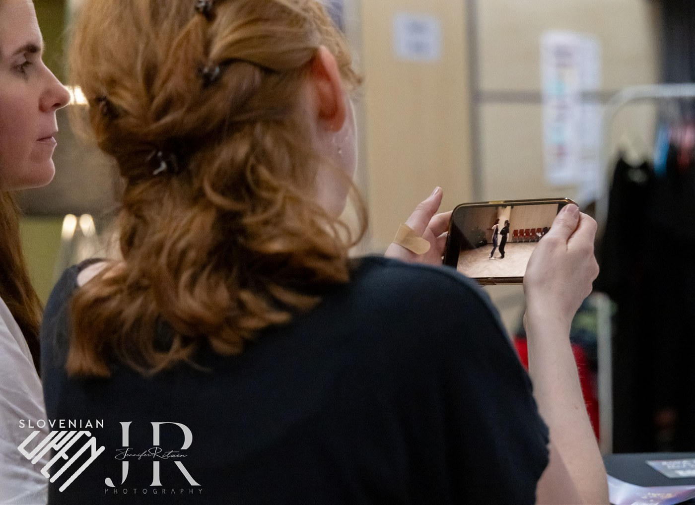
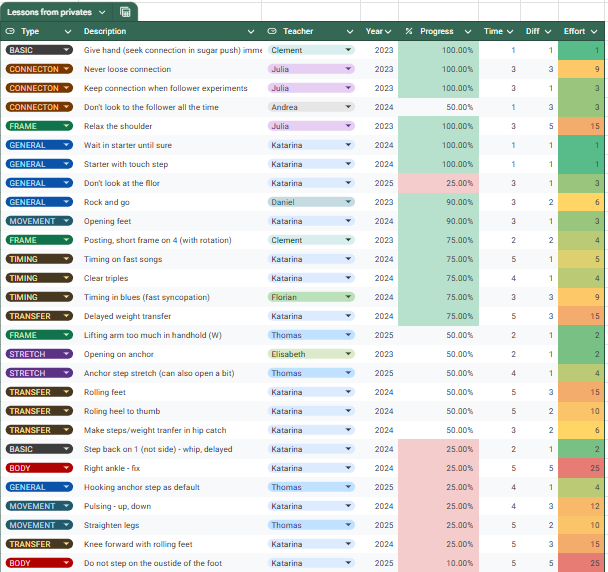
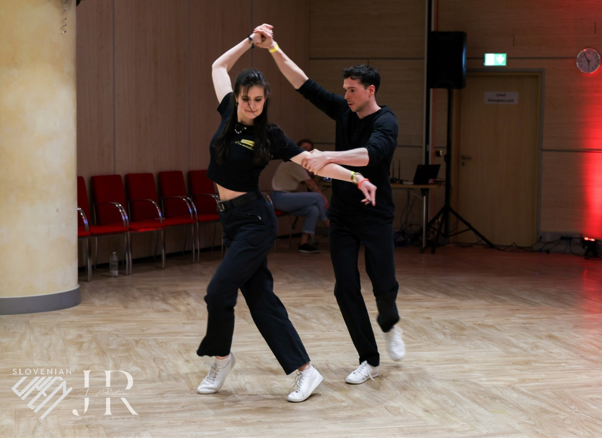

## Privatne ure

> Privatne ure so namenjene pospešenemu pridobivanju znanja, ki je prikrojeno našim potrebam. Po privatni uri si lahko obetate, da boste prišli do seznama stvari, ki jih morate popraviti in recepta, kako to storiti.

Na privatno uro običajno pripeljemo partnerja (rečemo mu tudi *dummy*). To je predvsem pomembno takrat, ko želimo od učitelja povratno informacijo, ki je vezana na naše tekmovalne nastope. Učitelj si bo namreč tako lahko naš ples ogledal in popravil stvari, ki so opazne vizualno.

::: box
[Začetna privatna ura]{.box-title}

**Učitelj:** Lokalni učitelj, ki uči tudi na tečajih.

**Namen:** Pridobiti osnovno znanje, da se lahko priključite neki vadbeni skupini/tečaju.

**Vsebina:** Osnovne tehnike in figure, ki so se jih ostali naučili na tečajih. Potek privat ure je lahko glede na vaše posobnosti precej hitrejši, kot na tečaju, vseeno pa potem tako pridobivanje znanja zahteva ustrezno vajo, saj znanje ni dobro utrjeno.
:::

::: box
[Klasična privatna ura]{.box-title}

**Učitelj:** Lahko lokalni ali tuji učitelj (npr. na festivalu ali na delavnicah). Dobro je, da z istim učiteljem delate večkrat zapored.

**Namen:** Izboljšati ples na dolgi tok, pripraviti daljši načrt treningov. (Ali: Dobiti specifično povratno informacijo od določenega učitelja.)

**Vsebina:** Običajno v privat urah izboljšujemo svojo plesno tehniko. Kot začetniki na uro pogosto pridemo brez načrta in od učitelja pričakujemo, da nam da neko usmeritev za naprej, mogoče z nami celo sestavi nek bolj dolgoročni načrt treninga. Ob tem je pomembno, da imamo tudi sami nek dolgoročni cilj (npr. želim priti v finale v *novice* kategoriji, želim biti uspešen v *intermediate* finalu, želim biti čimbolj prijeten soplesalec v družabnem plesu ipd.)
:::

::: box
[Mini privatna ura ali deljena privatna ura]{.box-title}

**Učitelj:** Običajno učitelj na festivalu ali vabljeni učitelj.

**Namen:** Dobiti specifično povratno informacijo od določenega učitelja (Ali: dobiti nasvet glede ene ali dveh stvari, ki bi jih izboljšal v plesu.)

**Vsebina:** Mini privat ura običajno traja od 5 do 10 minut. Na njej lahko pričakujete, da boste od učitelja dobili en nasvet. Če pridete na uro brez vprašanja, vas bo učitelj pogledal in izluščil eno stvar, ki se vam bo zdela najbolj pomembna.
:::

::: box
[Video analiza]{.box-title}

**Učitelj:** Najbolje je, da video analizo naredi kdo od sodnikov, ki vas je ocenjeval. Odlično je, če posnetke pošljete čimprej po zaključku tekmovanja, ko ima sodnik približno v glavi, kakšno je bilo stanje v vaši kategoriji.

**Namen:** Izvedeti, zakaj vas je sodnik ocenil tako, kot vas je in izvedeti, kako izboljšati ples (za njegove oči).

**Posnetki s tekmovanj:** Večina plesalcev ima navado, da vsa tekmovanja snema. Te posnetke pošljete učitelju. Najbolje vse tri pesmi.

**Vsebina:** Sodnik bo pogledal vaš posnetek in identificiral 2-5 bistvenih pomanjkljivsti (v primerjavi z drugimi tekmovalci v vaši kategoriji). Povedal vam bo, na kaj te pomanjkljivosti vplivajo in dodal navodila (ponavadi v video posnetku), kako jih odpraviti. Sodnik si bo ogledal tudi vaš celoten ples in vam bo lahko dal boljšo oz. bolj celostno povratno informacijo.

**Povratne informacije za sodnika:** Ogled posnetka bo predstavljal tudi povratno informacijo za sodnika. Imel bo priložnost, da si ogleda vaš celoten ples in pri sebi vidi, če je mogoče ples opazoval ravno v tistem trenutku, ko je šlo nekaj narobe.
:::

<figure>

<figcaption>Video analiza tekmovalnega nastopa.</figcaption>
</figure>

Koristno je, če vodite dnevnik lekcij, ki ste jih dobili na privatnih urah (primer je na spodnji sliki). Bistveno je, da si zabeležite, kaj morate popraviti, da imate neko navodilo, kako to popraviti (npr. povezavo na video posnetek, lahko prek datuma in učitelja) in nek indikator, kako uspešni ste bili pri treningu. 

<figure>

<figcaption>Izsek iz dnevnika privatnih ur.</figcaption>
</figure>

Za vadbo stvari, ki ste jih izvedeli na privatni uri, lahko izkoristite samostojne treninge solo ali v paru, doma ali v plesni dvorani, preplesavanja in včasih tudi zabave. 

Različni ljudje se učimo na različne načine. V grobem je bolje določeno tehniko vaditi omejen čas (npr. 5-15 minut) in se pri tem osredotočiti na eno samo stvar. Npr. vadimo zakasnjen prenos teža na prvo dobo (in se požvižgamo na vse ostale). 

Privatne ure brez pripadajočega treninga večinoma nimajo veliko haska.

**Pomembno:** S treningom določene tehnike pogosto pokvarimo druge (dobre) navade. Splača se to večkrat preveriti. Npr. z zakasnjenim prenosom teže na 1 lahko včasih podremo povezavo s partnerjem ali celo izvajanje koraka nazaj pri leaderju v začetku figure.

<figure>

<figcaption>Vaja prinaša rezultate.</figcaption>
</figure>
